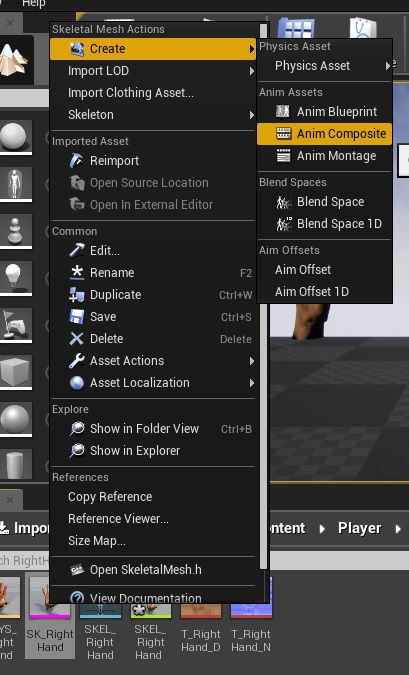
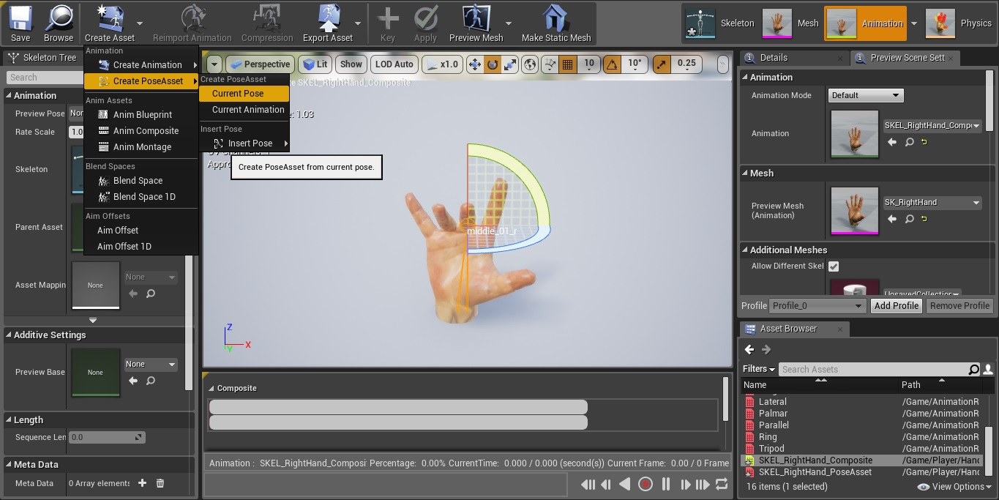
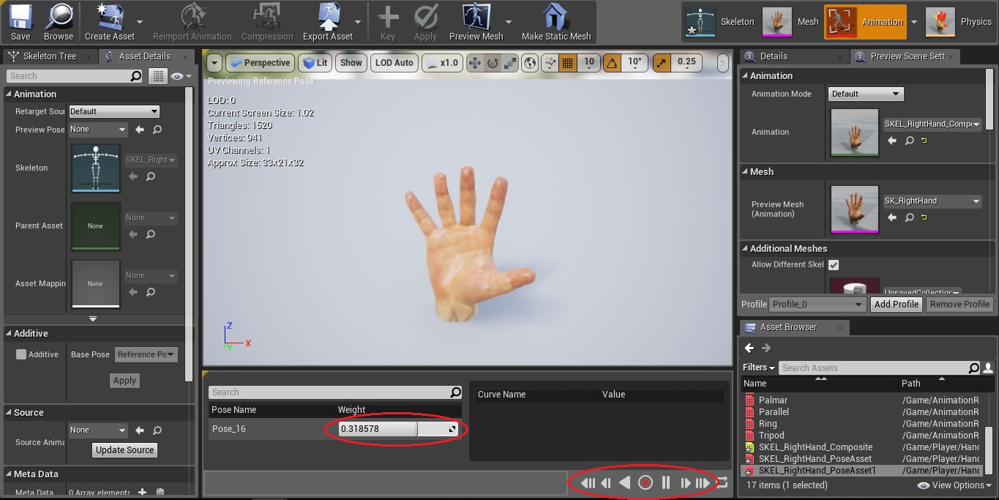
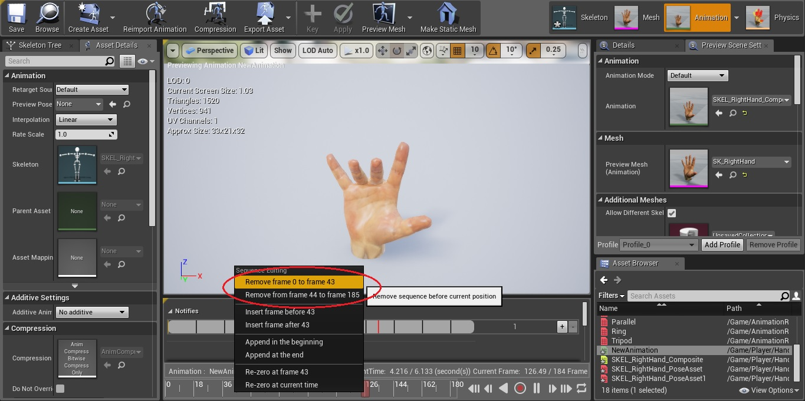

## Create new animations 

This tutorial shows and explains how to create new animations, which are used to create new handle types. The object (mesh) used in this tutorial is a hand. This object contains a skeletal framework that allows the hand to be deformed in predetermined directions.

In order to create an animation from which new grip type information can later be read out, an "Anim Composite" animation must be created first. The "Anim Composite" is only used to create a "Pose Asset". To create an "Anim Composite", right-click on the hand mesh in the Content Browser. Then click on the button "Anim Composite" under "Create".

After selecting the storage location, the animation editor opens. The current pose of the hand is the starting pose for the animation to be created. The hand should now be deformed so that it is in the desired final pose of the animation. If the hand has the desired position, a new "Pose Asset" can be created under "Create PosAsset" -> "Current Pose".

Subsequently, a location for the "Pose Asset" is selected and a new editor opens.
This editor features a slider that represents the start position at 0 and the end position of the animation at 100. In addition, all intermediate steps from 0 to 100 are calculated and displayed by the Unreal Engine.

At the bottom of the editor, there is a record button to record new animations.
After pressing the record button, a location for the animation has to be selected. Subsequently, the hand shown in the editor is filmed. Now you can slowly move the slider from 0 to 100. Recording is stopped by pressing the record button again.

Finally, all you have to do is open the newly created animation and crop it in the timeline.

