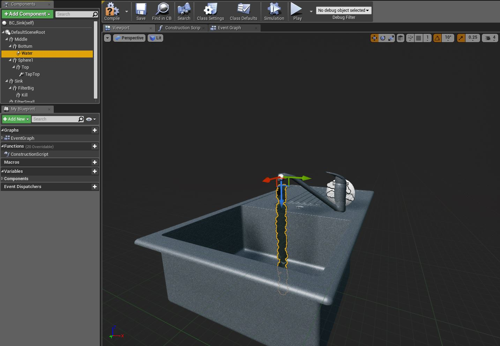
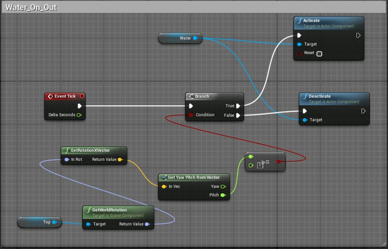
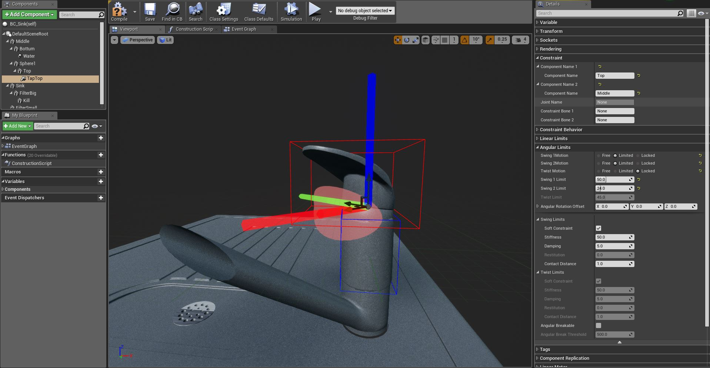
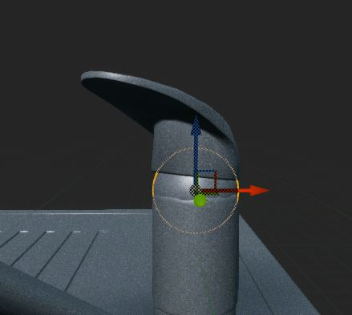
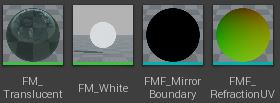
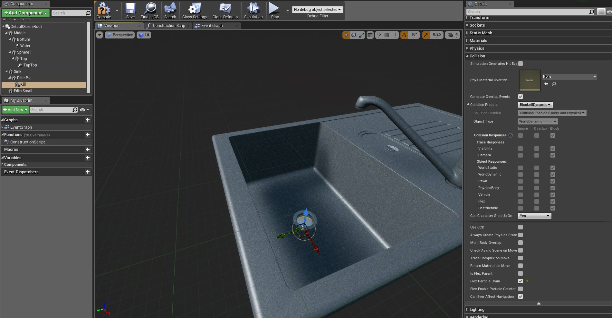
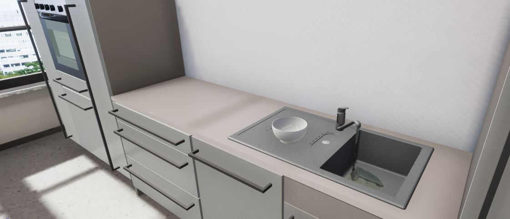

## Documentation

At the beginning of the project Nvidia Flex had to be installed. For this, a separate version of the Unreal Engine had to be [downloaded](https://github.com/NvPhysX/UnrealEngine/tree/FleX-4.17.1) in which Flex is implemented. To start the download you have [to set up](https://www.unrealengine.com/en-US/ue4-on-github) a GitHub account and add the corresponding repository. In addition, a registration with Nvidia is required.
After downloading Flex version 17.1, it was installed as described in this [video](https://www.youtube.com/watch?v=uNtePpTuX1g&t=289s). The installation time heavily depends on the performance of the used PC and can take more than 8 hours.

After successful installation of Unreal Engine Flex version, the Flex version of the RobCoG project has been [downloaded](https://github.com/robcog-iai/RobCoG/tree/dev-flex). The meshes of the sink from the RobCoG project have been added to a newly created blueprint. In addition, an emitter was added to the Blueprint. The emitter was placed in the outlet of the pap. 
With the help of this blueprint an on-and-off-function for the emitter was generated. The function compares the angle of the tap handle in relation to the abscissa of the world coordinate system  with an entered value. If the fixed value is exceeded, the emitter is activated and deactivated again if the value is not reached. 

This simulates turning the tap on and off. To create a rotation of the handle for a defined area, a physics constraint has been implemented in the blueprint. The constraint connects the handle of the tap with its central part. 
In addition, physical behavior must be present for the grip, since only then the grip can be moved by physical influence (in the form of a virtual hand). Since the rotation creates a gap between the grip mesh and the midsection mesh, a sphere has been integrated between both parts, which closes this gap and serves only as an optical enhancement. 

The emitter continuously generates fluid particles when activated. The particles are generated by using Nvidia's Flex and thus have a very [realistic fluid](https://www.youtube.com/watch?v=2gp7-ejkwBQ) behavior. The visual appearance of the particles was also determined using Flex. 

In to order to represent the fluid, made of Flex particles, as realistic water, various settings were made, which are described in more detail in this tutorial. The particles have no activated lifespan and die only on contact with the drain. For this purpose, an invisible sphere was implemented in the drain. Additionally, the sphere has no collision and is only used to kill the Flex particles. 
Since even with optimized collision query the Flex particles repeatedly penetrate the sink, a distance to the emitter was set, at which the particles automatically die.

Finally, the sink from the blueprint replaced the standard sink of the RobCoG project and serves as a new sink for the simulation environment. 
The particle system has been optimized by its settings in such a way that a realistic impression of water is created and nevertheless works very well.
