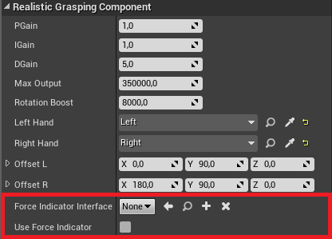
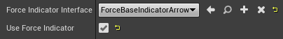
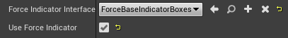

# Force Indicator description
This little side project has the intention to visualize and to debug the force that is used in order to grasp something.

This was only a side project (optional part in our milestone) and because of that we didn't spend that much time into this. We only created two basic example visualization classes that should show the possibilities.
If you want to create your own version you can easily do it because we separate everything from the logic part. You need basically only include one interface in order to create your own version. See the tutorial below.

# How to use a force base indicator class

* First of all you will need a functional character that contains our **grasping component** (see for more details [Using our plugin](./tutorialChar_Bind.md)).

* Select then our **grasping component** and search for the two variables **Force Indicator Interface** and **Use Force Indicator**.



* Here you will need to set the boolean **Use Force Indicator** to true and you will also need to select a class that should visualize the force. There are at the
moment two example classes in the module **URealisticGraspingForceIndicator** that you can use. Just select the class here and the component will create and object from your class.
He will use the Interface to send informations to this class. Of course this class needs to implemented the interface **IForceBaseIndicatorInterface** otherwise our component will ignore this setting.

Example setting for the arrow class.



Example setting for the box class.



* That's it. See the results.

Arrow force indicator.


Box force indicator


# How to create your own class

* In order to create your own visualization class, you will need to create a **UCLASS** class, and this class also need to implemented the interface **IForceBaseIndicatorInterface**. [See the interface](../Plugins/URealisticGrasping/Source/URealisticGrasping/Public/ForceBaseIndicatorInterface.h)

* After this you will need to override two functions from the interface:

```cpp
//Overrided function from the interface
virtual void CreateNewHandDebug(ASkeletalMeshActor* CurrentHand, bool bIsRightHand, float DeltaTime);

//Overrided function from the interface
virtual void SetGraspingData(FHandAnimationData Data, bool bIsRightHand);
```

* The function **CreateNewHandDebug** will be called every tick and gives you the information which hand should be visualized at the moment.

* The function **SetGraspingData** will be called every time when the animation for one hand has changed. With this function you will get the current animation, which contains all bones that are used in this animation.

* The Interface has also two other helper functions. You can use them or you can also override them but you don't need to. [See the interface](../Plugins/URealisticGrasping/Source/URealisticGrasping/Public/ForceBaseIndicatorInterface.h)

* You can look into the two classes **UForceBaseIndicatorArrow** and **UForceBaseIndicatorBoxes** to see an example how you can use and implemented the interface.
[See the arrow class](../Plugins/URealisticGrasping/Source/URealisticGraspingForceIndicator/Public/UForceBaseIndicatorArrow.h), [See the box class](../Plugins/URealisticGrasping/Source/URealisticGraspingForceIndicator/Public/UForceBaseIndicatorBoxes.h)

# Problems and tips

* In the examples (see the gifs above) you can see that there are some problems with the color. The idea was to interpolate between green and red depending on how strength are the current force but there are some
problems with the method that we used to interpolate between them. Currently we are using [FLinearColor::LerpUsingHSV](https://api.unrealengine.com/INT/API/Runtime/Core/Math/FLinearColor/LerpUsingHSV/index.html) but
maybe you will need to use a different one.

* Also we didn't found a good way to get the current force. At the moment we used the angular force in the constraints. But its not working well.

* It can be happened, that when you are using the arrow force base indicator class, that your game will crash. It maybe happened because we calculate every tick the new force a draw it new. Maybe it's better to calculate
and draw the force not every tick or use a completely different method.

* The functions from the class [DrawDebugHelpers.h](https://wiki.unrealengine.com/Draw_3D_Debug_Points,_Lines,_and_Spheres:_Visualize_Your_Algorithm_in_Action)
that are currently used to visualize the force are also maybe not the best choice. Maybe it would be better to use your own widget or actors that are attached to every bone.

# Some useful Links

* [FBodyInstance](https://api.unrealengine.com/INT/API/Runtime/Engine/PhysicsEngine/FBodyInstance/index.html) can be used to get a better force value

* [UPhysicsAsset](https://api.unrealengine.com/INT/API/Runtime/Engine/PhysicsEngine/UPhysicsAsset/index.html) can be used to get a better force value

* [Interfaces in C++](https://wiki.unrealengine.com/Interfaces_in_C%2B%2B)
