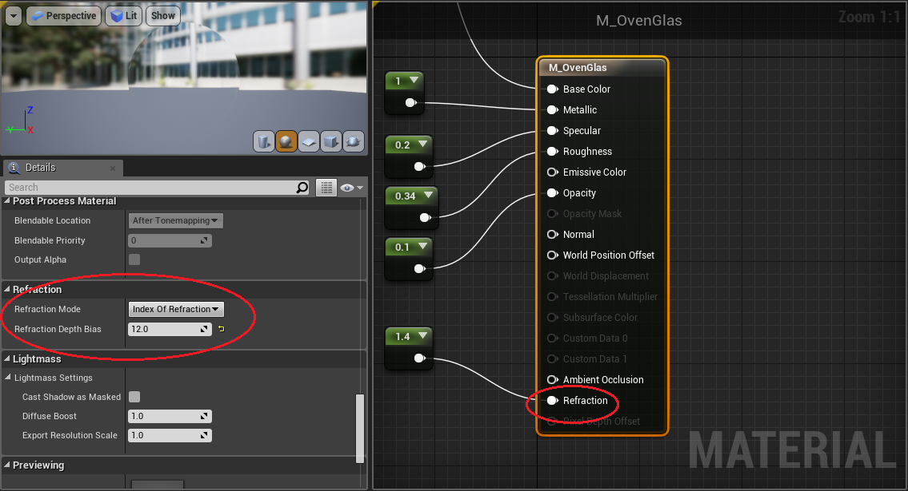
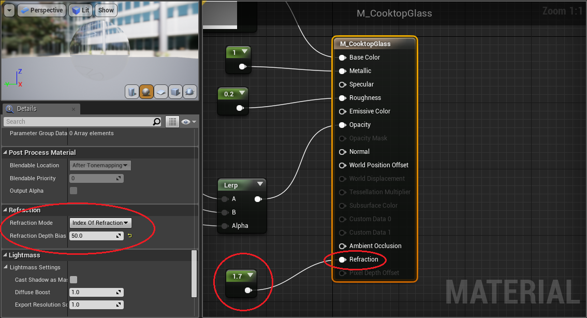
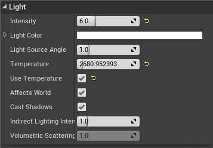
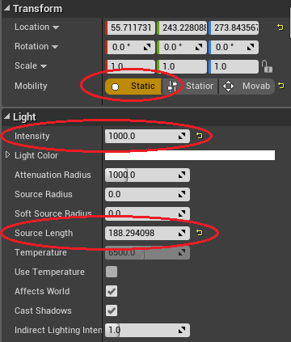
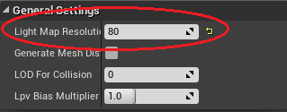

# Instructions for improve the light atmosphere 

In the World “Sunset” various changes and improvements have been made to improve the lighting mood of the RobCog kitchen. Improvements have been made on the materials of the oven and cooking plate, on the directional light "sun", and on the point lights "lamps in the kitchen". The result of these improvements can be seen in the following Image.

## Improve material of the oven and cooking plate

To improve the visual presentation of the oven and the cooking plate, the physical laws of light refraction and light reflection were added and set  to glass materials.
The following two Images show the selected settings.
The refraction values ​​used here are close to the refractive index of glass (1.5). 
With these chosen values, the best optical results were given. 
In addition, the refracted depth bias was set. For further information on the refracted depth bias: [Link](https://api.unrealengine.com/INT/Resources/ContentExamples/MaterialProperties/1_11/index.html)

## Improve the directional light

To create the light atmosphere of a sunset, the settings which are shown in the following image,  had to be set . All the settings can be found under the details of the directional light. It is very important for this atmosphere  to use the temperature of the light. With this options it is possible to create a warm red light. 

## Improve the point lights

All lamps in the kitchen got a point light. The lights are static and have been scaled to fit the length of the kitchen lamps. The static setting must be chosen, because when the light rays are overlapping only three dynamic lights can exist together. Furthermore, the point lights have a much higher intensity than the directional light, because this light should overlap the “sun-light”. This overlap makes the kitchen look more realistic. 
All settings are shown in this image.

## Improve the mesh

The setting Lightmap Resolution exist In the Mesh-Editor.  This essentially allows for adjustment of the shadows across this surface. The lower the number, the denser the shadow is displayed. In case of the sink-mesh the value is very high. It looks more realistic for the created light atmosphere.

