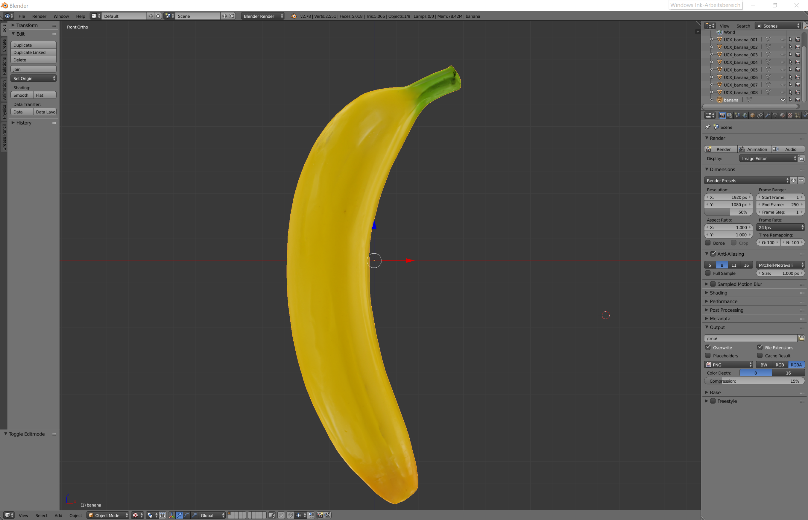
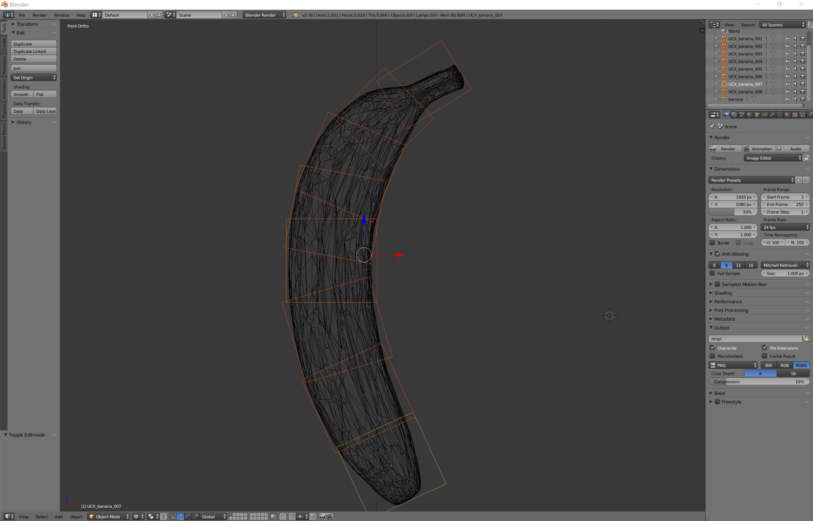
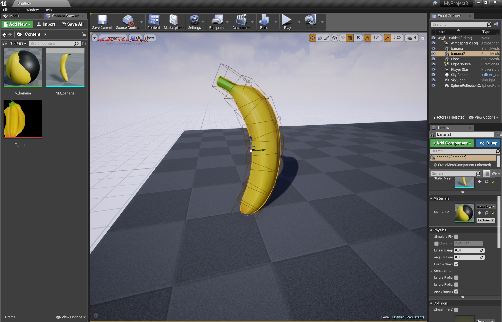

# Milestone1

* Optimize object from the YCB Benchmark list in Blender
* Add Objects to Unreal
* Scan 1/2 Objects
* Improve lightning a bit
* Optimize some furniture so it has a one-to-one mapping with real furniture

# Documentation

* We optimized the objects from the YCB Benchmark list
  * Reduced number of triangles in the mesh
  * Fixed holes
  * Smooth objects
  * Repair some texture issues
  
  * Add hitboxes
  
  
* Imported the fbx files in Unreal Engine 4
 * Activated and tested hitboxes in Unreal
 * tested visuals and lightning of the objects
 * create mesh, texture and material
 

* Scanned a new object and a defect old one
 * Old object has too high quality to reduce to our standarts, caused from merging too many different scans
 * Some parts of the new object are not be detected from the scanner so they had to be fixed by hand
 
