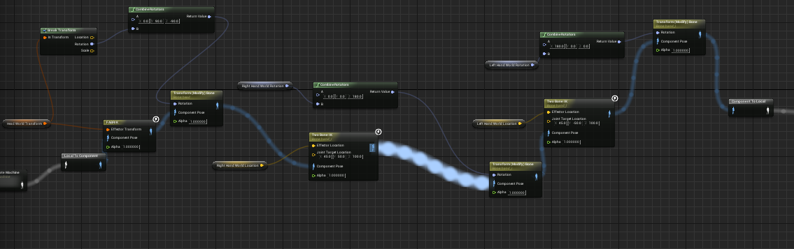
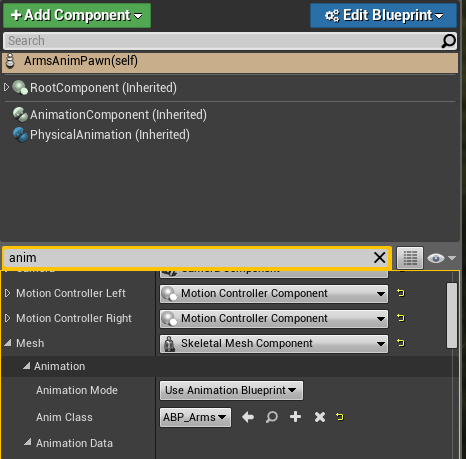

# Milestone 1 - deadline 31.12.17

* Create our own blueprint (c++ code) that lets us control a characters head and arms using inverse kinematics
* Fix offsets (if any) (htc vive and oculus rift)
* Natural movements of the hand (no self collisions)
* Maybe start with the restrictions (constraints) of the arm movement
* Using the generic male body (rigging it)

# Documentation
* New Plugin: VRArmsTracking
* New classes: ArmAnimInstance, ArmAnimPawn, CReadWriteComponent

* ArmAnimInstance
Translates the coordinates from the motion controllers to fitting coordinates for unreal.
* ArmAnimPawn
Pawn which will be controlled with the motion controllers and the headset. With the location and rotation coming from the controllers this
pawn will support realistic arm movement. Physical animation can also be enabled in the code for the given mesh.

* CReadWriteComponent
Writes to location and rotation coming from the motion controllers and the headset in a file. Then it can read the data and replay 
the data.

* Main functionalities:
Full arm tracking using only VR devices (Oculus or HTC Vive).
*Useful links:

# Tutorial:

- Create an animated blueprint using SKEL_Skelet as skeleton and the ArmAnimInstance as animation instance.
- Edit the anim graph of the new created blueprint like this:

- Create a new blueprint from the ArmAnimPawn classes.
- Set the anim class of the blueprint to the animated blueprint you just created.

- Place the blueprint in the world and hit play.
