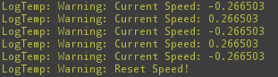

# Tutorial Milestone 1 - Simulation of a realistic walking 
* The functionality of the walking can easily be testet by starting the RobCoG.uproject, starting the game and moving around with W, A, S and D. The character should start in a slow movment speed and getting faster, until the character reaches the maximum speed.  

* If the game is startet from the RobCoG.sln, in the debug mode, the movment speed will be printed in the output log of the Unreal Engine Editor. It will also mention at which point the speed is being reseted. The speed also depends on the direct which is pressed, so it will be negativ for walking backwards or to the left. The following picture shows the output of the speed, in this case it switches between 0.26 and -0.26, because the character walks forward and left and the speed reset, which is called when the character does not move.   

# Tutorial Milestone 1 - Rotation of objects
* The functionality can easily be tested by picking up an object in the game and pressing the tab button. Afterwards it is possible to rotated the object with horizontal and vertical movments of the mouse. At the moment the left or right mouse button have to be pressed before the rotation stiwches to the hold object. So if the left hand holds an object it is needed to press te left mouse button and afterwards the tab button to rotate the object and before rotating the right hand object the object has also to be activated with the right mouse button before entering the rotation mode with tab. This will be fixed in the next iteration.
