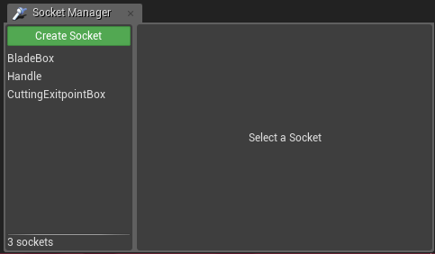
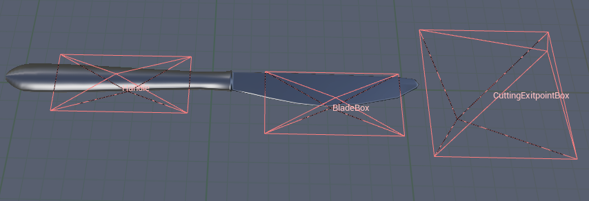
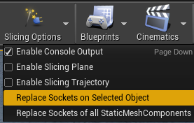
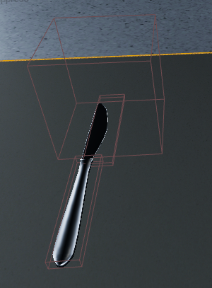
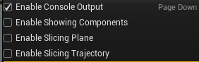

# Milestone 2 - deadline 30.03.18

* Realistic cutting
  * Blade only goes through cuttable objects (e.g. not through the table)
  * Handle does not go through cuttable objects (or any other objects for that matter)
  * Cutting can be prematurely aborted by pulling the knife from the object without completing the "slicing motion" (for which the cutting tip will be needed)
     * (Optional) Cutting tip functionality 
* Advanced debug visuals
  * See cutting start-/end-point at object
  * Trajectory when starting/stopping slicing action (see how object is cut)
* VR capabilities
  * Testing the functionality of the cutting plugin in a VR environment
* Working scenarios
  * Cutting object horizontally
  * Cutting same object vertically multiple times (e.g. slices of bread)
    * The knife should not go through the table while doing so
* (Optional) Automate process of adding/changing necessary properties of cutting/cuttable objects
  
## Features
These are all currently NEW implemented features that are useable in other projects (ontop of the ones mentioned in [Milestone1](Documentation/Milestone1.md)):

* Tip functionality was added
  * The blade now must go through an object entirely to cut it.
  * If the blade is pulled out completely (so that it was removed perpendicular to the original cutting motion) then the cutting-process will be aborted and must be properly restarted
  * If the user tries to start cutting with the tip and not the sharp end of the blade, the cutting process will not start and the cuttable object will just be pushed around instead
* Visual debug options were expanded and enhanced
  * The start and the end of the cutting process is now visualized with two green rectangles placed on either end
  * The trajectory of the blade component is now tracked with small blue dots showing where the blade is moving while still being in the cutting process
  * All USlicingComponents can be toggled to be shown in runtime
  * The debug-plane now better represents the way the object is going to be cut
* All previous resistances in VR were removed, so that cutting feels more natural and doesn't abrubtly end without the user knowing why
* Objects can now be made cuttable/cutting via two new entries in the slicing toolbar menu entry (instead of manually editing the properties of the objects)
  * Multiple objects can be "converted" via that method simultaneously
  * The changes are now tracked in the level and can be permanently saved in it (including the new Components of a cutting object)
  * The sockets for the three components still need to be manually added via the static mesh editor
  * The components that are now completely represented by the defined sockets. That means the size and position of the sockets affect the size and position of the attached components 1:1 and can even be changed while the components are attached, making fine-tuned placement easier.

# Documentation

* The project is still realized by a plugin with the two modules, while using a custom component that inherits from UBoxComponent. Besides the new features added in this milestone, a lot of work went into refactoring the code to have proper structur and easier readability and understandability.
* (Side-Note: Slicing and cutting might be interchanged in the documentation, but in the source-code, it was tried to seperate the logical process needed for the slicing to happen (which is referred to as "cutting") and the slicing itself (referred to as "slicing"). Basically "cutting" would refer to the fact that the blade and another object is colliding with each other, while still waiting until the "slicing" process is started. That distinction is not needed to understand the code, but the nuance still exists.)

### SlicingEditorModule:

* While the core-code stayed the same, most code in `FSlicingEditorActionCallbacks` was refactored into different seperate functions, as it reduced code-repetition and decreased the clutter of the now renamed `ReplaceSocketsWithComponents()`-function (that is now called `MakeCuttingObject()`). All the refactored functions should have self-explenatory names and only serve one purpose, so besides the already explained parts in the [Milestone1](Documentation/Milestone1.md) documentation, nothing else has to be added to the documentation.
* Other than refactoring, a few new buttons were added analogous to the other existing buttons of the first Milestone.

### SlicingLogicModule:

* The logic module was now expanded by two new UClasses: `USlicingBladeComponent` and `USlicingTipComponent`, both of which inherit from `USlicingComponent`.
  * FSlicingLogicModule:
    * This class is technically only needed for the plugin module to load, which houses the slicing components needed for the cutting.
    * Because of the emptiness of the class, it also houses other static functions related to cutting (which as of right now only includes a function to convert a static mesh into a procedural mesh). This might be later moved to another class, if more static functions are added.
  * USlicingComponent:
    * This is the base class for the other slicing components. The handle does not have its own component as of right now, because it does not have any specific functionality besides colliding with solid objects, which BoxComponents can inherently do.
    * Commonalities between the blade and the tip - like being able to tick and being drawn as a visual debug option - are found here.
  * USlicingBladeComponent:
    * The `BeginPlay()` function is used to register the overlap events as before but it also registers the tip component attached to the same parent as well. The blade needs to know the tip component so that the cutting can be properly aborted once the blade is fully pulled out or never started to begin with, if the user tries to start cutting with the tip.
    * As before, `OnBeginOverlap` checks for all sorts of cases where the cutting-process should never start. After converting the cuttable object into a procedural mesh and overlapping with that new procedural mesh, the state of the blade component is prepared for the slicing.
    * The slicing itself happens only after the overlap ends in `OnEndOverlap`. Here there are new checks to prevent faulty or unwanted slicings to happen. The slicing function was moved to `SliceComponent`, which still does the same thing of calling the `SliceProceduralMesh` function of the `UKismetProceduralMeshLibrary` while ensuring certain properties are set for the newly created procedural mesh.
    * `TickComponent` is only used for the debug visuals, as they are the only things that need to be computed/drawn every frame.
  * USlicingTipComponent:
    * The tip knows the blade component and its sole job as of now is to invalidate the cutting process by resetting the `bIsCurrentlyCutting` flag when the tip touches the same object the blade is currently cutting. This is done, because that scenario would only happen if the blade isn't fully cutting the object and the "knife" is slightly pulled out, which wouldn't result in a clean cut.
    * Right now the consoles displays the current state of the tip to help with testing the correctness of its functionality

# Tutorial

## Creating a new knife

### Step 1: Creating Sockets in the StaticMeshEditor

For this first choose a StaticMesh on which you want the SlicingLogic to be.
In this example we use the **SM_Knife_Table**. Double click on it in the
**Content Browser** to open the StaticMeshEditor for it.

In the top bottom should be a tab called **Socket Manager**. Press the button
and add three sockets named **Slicing Blade**, **Slicing Handle** and **Slicing Tip**.
It should look like this: 

From there on you can begin to place the tokens as needed in the StaticMeshEditor, e.g.

With that done you can save the StaticMesh in the StaticMeshEditor and leave it.
All the StaticMeshComponents with that StaticMesh now all have these Sockets.

### Step 2: Spawn the boxes in the Editor

Now that the knife has the boxes, we can begin to spawn them inside the editor.
First we select the StaticMeshComponent in the Editor.

Then on the top, in the same row as **Play** and **Launch**, there's the button
called "**Slicing Options**", clicking on it reveals more options such as Debug
Checkboxes. The important Button is "**Make Selected StaticMeshActors Be Able to Cut**".

After clicking it, it spawns the BoxComponents. If they don't appear at first
simply click on something else and click on the knife again. It just needs
to refresh.

***The Knife is done. Result:***

## Make Object Cuttable

* Step 1: Select the wanted static mesh components in the world.
* Step 2: Go to the slicing toolbar entry, as above, and press the "Make Selected StaticMeshActors Cuttable" button.

## Activating Debug

* Step 1: Click on Slicing Options as in the tutorials above.
* Step 2: Check the desired Check Boxes in the popped up window.

	

## Todos

- Realistic Interactions and Physics of the Knife

## Issues

- The Debug Box showing the presumed exitpoint of the knife is only shown correctly at the first cut of the object.