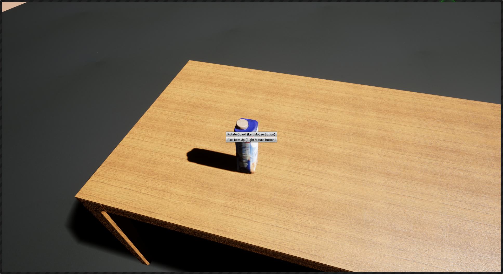
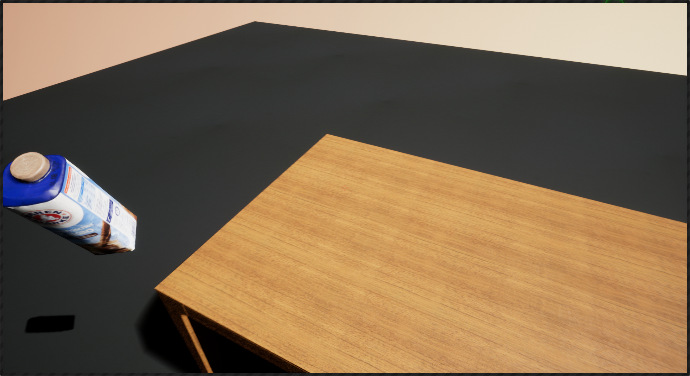

# Tutorial Milestone 2 - Pickup and object rotation with a menu

* To pick an object up you have to look at it and push the right mouse button and afterwards the following menu will pop up.

Now you have the choice either pick the object up (does not work at the moment) or rotated it. If you choose to rotated the object it will be moved to the center of the screen (an actor is used as placeholder) and it is now possible to rotate it with the mouse movement (at the moment a bit buggy).  

When you are finished with the rotation you can push the right mouse button again and menu for moving the object to the right or left hand will be called. 
   
The object can now be moved to the left or right hand with just pressing a mouse button.

