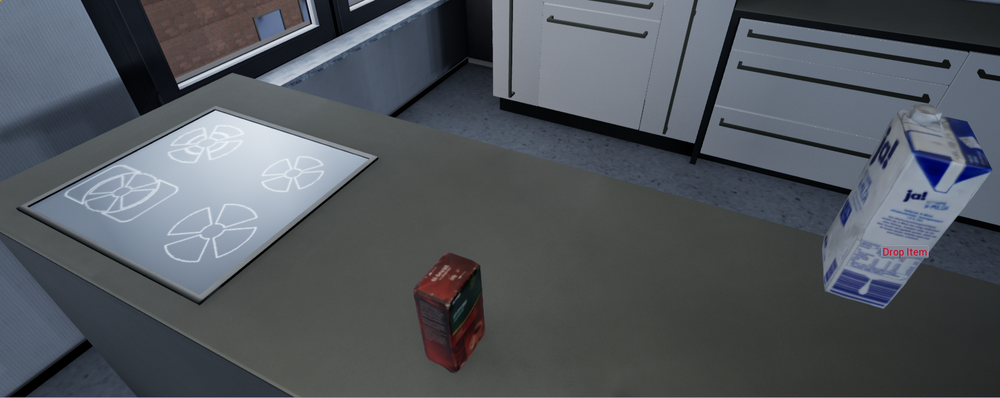
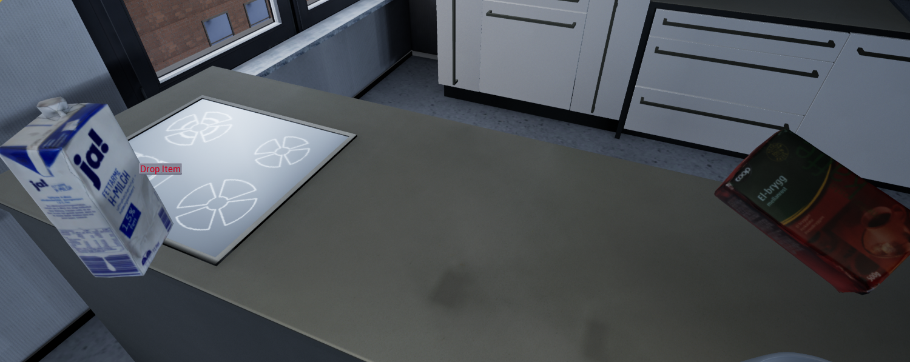

# Tutorial Milestone 3

* The free mouse mode starts after pushing the right mouse, than it is possible to hover with the mouse cursor of objects. While the mouse is over an interactbale object the right mouse button can be pushed again, to start an interaction menu. If the object is lieing on a surface the pick up and rotation butto will appeare.  

* Objects are also now picked up depending on the position of the object to the character, so if the object is to the right it will be put in the right hand.  

* If the rotation button was pushed the object will be put into the rotation position in front of the character, where the object can be rotated with the movment of the mouse. After the rotation you can press the right mouse button again to stop the rotation and again interact with the object. It can now be picked up in the left or right hand. If it is picked up into the left hand and an object is hold it will instead be put into the right hand. 

* The last menu will appear if you interact with an object in one of the hands. This menu button is "Drop Item". This function is at the moment not implemented.

