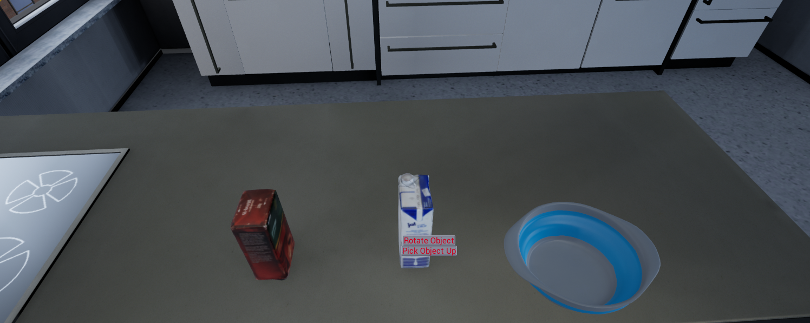

# Tutorial Milestone 3 - 

* The free mouse mode starts after pushing the right mouse, than it is possible to hover with the mouse cursor of objects. While the mouse is over an interactbale object the right mouse button can be pushed again, to start an interaction menu. If the object is lieing on a surface the pick up and rotation butto will appeare.

