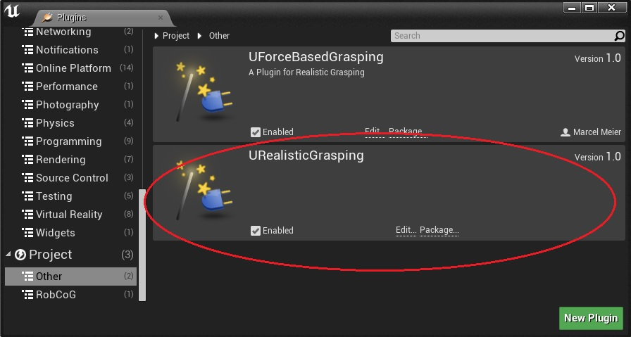
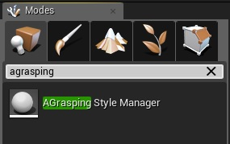
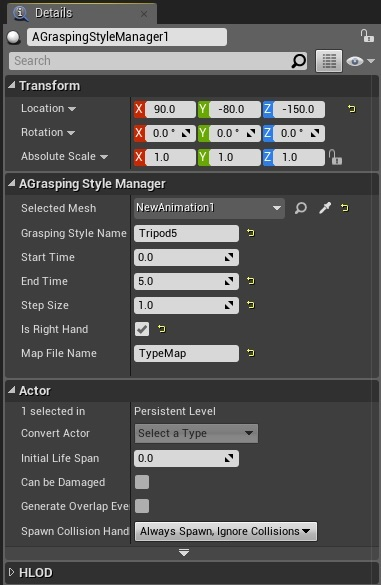
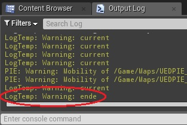

## Reading handle types

This tutorial shows and explains how to use the "URealisticGrasping" plugin to read in new grip types. (The grip types can only be read in via animations that are in the same world as the “AGrasping Style Manager” object.)

In order to use the plugin, the plugin library "URealisticGrasping" (under “Others”) must be activated in the plugin library of the Unreal Engine (in the editor "Window" -> "Pugins").

Then you can search for "AGrasping Style Manager" in the object browser (Modes).

The "AGrasping Style Manager" object can be dragged into any world. If the “AGrasping Style Manager” is in one world, it must be selected next. This is most easily done via the World Outliner.
In the “Details” window, the following settings can be made under the item "AGrasping Style Manager":

* Select Mesh: Here you have to insert an animation (which exists in the world). The arrow can be used to select an animation. Alternatively, the pipette can be used to pick an animation from the world.

* Grasping Style Name: Enter a name for the grasp to create.

* Start Time: Star time of tracking after pressing the “Play” button.

* End Time: End time of tracking after pressing the “Play” button.

* Step Size: Tracking intervals from the start time to the end time of the tracking.

* Is Right Hand: A tick must be placed here to track the right hand of the animation.

* Map File Name: Enter the name of the map file here.

After all settings have been set, the output log must be activated in the editor (Window -> Developer Tools -> Output Log). Now the “Play” button (Select Viewport) can be pressed.
If the output log "LogTemp: Warning: end" is displayed, the new grasp has been read in successfully.

