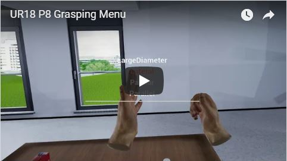
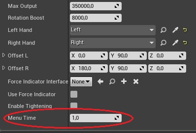
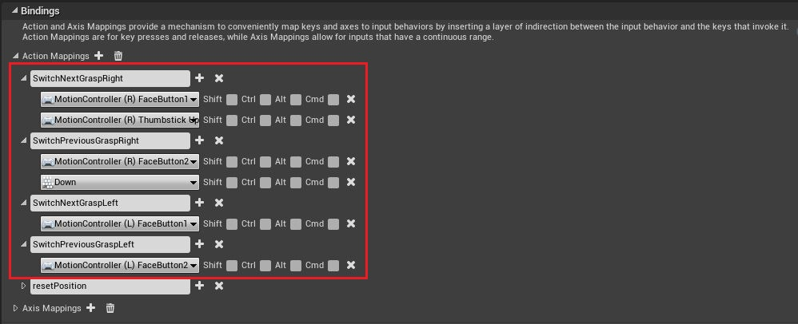

# Realistic Grasping User Interface

The user interface consists of two menus which are assigned to one hand each. The menus show different types of handles created for each hand. To call up one of the menus and select one of the handles, press the A or B button on the respective Motion-Controller. At the beginning of the game, no grip is selected yet. After selecting the handle, the menu disappears automatically after a short time. The default time is one second. This time can be set arbitrarily in “Details” of the GraspingComponent under the item “MenuTime”.

[](https://youtu.be/zgriCXSO_es)



## Adjustments

### Panel/Box:
Instead of using a ScrollBox, you can replace it with another Panel/Box.
It can be replaced by a [UWrapBox](https://api.unrealengine.com/INT/API/Runtime/UMG/Components/UWrapBox/index.html), [UVerticalBox](https://api.unrealengine.com/INT/API/Runtime/UMG/Components/UVerticalBox/index.html) or [UHorizontalBox](https://api.unrealengine.com/INT/API/Runtime/UMG/Components/UHorizontalBox/index.html), for example. Of course, the ScrollBox can also be replaced by its own Panel/Box.
To change the box, only the object type in Hadder needs to be changed. Of course, customizing the name of the variable makes sense. In addition, the UPanelSlot object type (in this case UScrollBoxSlot) has to be adjusted accordingly.


```
GraspingMenu.h

	
	//Box element in which the buttons are located
	UScrollBox* ScrollBoxMenu;
```
```
GraspingMenu.cpp

	
	ScrollBoxMenu = WidgetTree->ConstructWidget<UScrollBox>(UScrollBox::StaticClass(), TEXT("ScrollBox"));

	UCanvasPanelSlot* ScrollBoxSlot = Cast<UCanvasPanelSlot>(ScrollBoxMenu->Slot);
```

### Text-Layout:
The text color and font can be changed in the GraspingButten.cpp class.
A change of the font can be made as follows:

```
GraspingButton.cpp

	
	Textbox->ColorAndOpacity (FLinearColor);
```

The color of the text can be adjusted via the text box. In order to do this, the command "ColorAndOpacity (FLinearColor)" must be used. All details about FLinearColor can be found [here](https://api.unrealengine.com/INT/API/Runtime/Core/Math/FLinearColor/index.html).

### Button-Layout:
The button layout can be adjusted in the GraspingButton.cpp class.
To change the layout of the button, the command SetStyle (const FButtonStyle & InStyle) can be used. You can find more information about [SetStyle()](https://api.unrealengine.com/INT/API/Runtime/UMG/Components/UButton/SetStyle/index.html) and [FButtonStyle](https://api.unrealengine.com/INT/API/Runtime/SlateCore/Styling/FButtonStyle/index.html) here. Another command to change the appearance of the button is [SetColorAndOpacity()](https://api.unrealengine.com/INT/API/Runtime/UMG/Components/UButton/SetColorAndOpacity/index.html). With the command SetColorAndOpacity() both the button color and the text color are changed.

```
GraspingMenu.cpp

	
	NewButton->SetColorAndOpacity(FLinearColor(1, 1, 1, 0.2));
```

### Motion-Controller input:
It is also possible to change the input keys of the Motion Controller. To do this, go to Edit-> Project Settings-> Input and select the desired input method:



### Change Widget:
Due to the modular design, it is also possible to exchange the entire menu. This requires replacing the widget classes.
Please note hat the following lines may need to be adjusted in the GraspingComponent.cpp class:


```
URealisticGraspingComponent.cpp


	//The left GraspingMenu is being created
	MenuLeft/MenuRight = CreateWidget<UGraspingMenu>(GetWorld(), UGraspingMenu::StaticClass(), TEXT("MenuLeft"));
	
	//Has to be executed in this order
	MenuLeft/MenuRight->RebuildWidget();
	MenuLeft/MenuRight->SetArray(GraspArrayLeft);
	MenuLeft/MenuRight->CreateMenu();


  The Funktion:
	ActionFunctionsMenu(UWidgetComponent *WidgetCompnent, UGraspingMenu *Menu, int GraspIndex, bool PreviousOrNext)

```

(Changing the handles is also possible without UI, since this function works independently of the UI)

