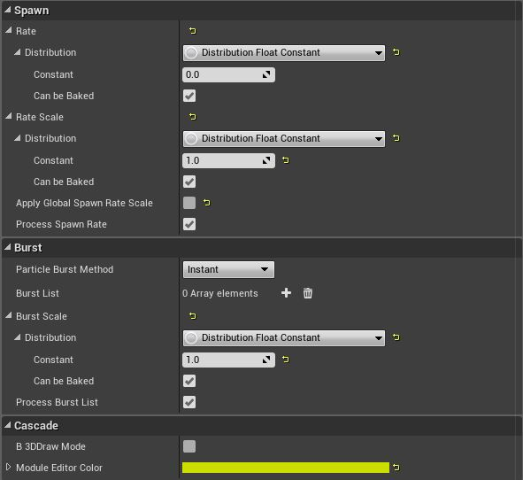
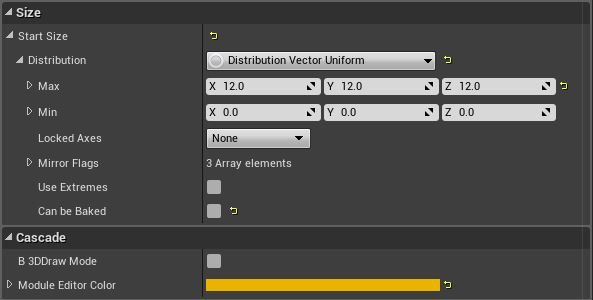
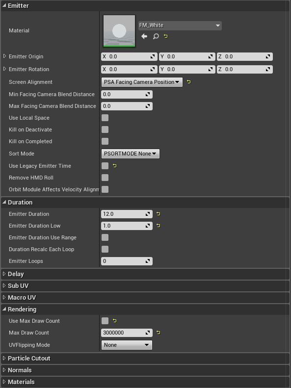
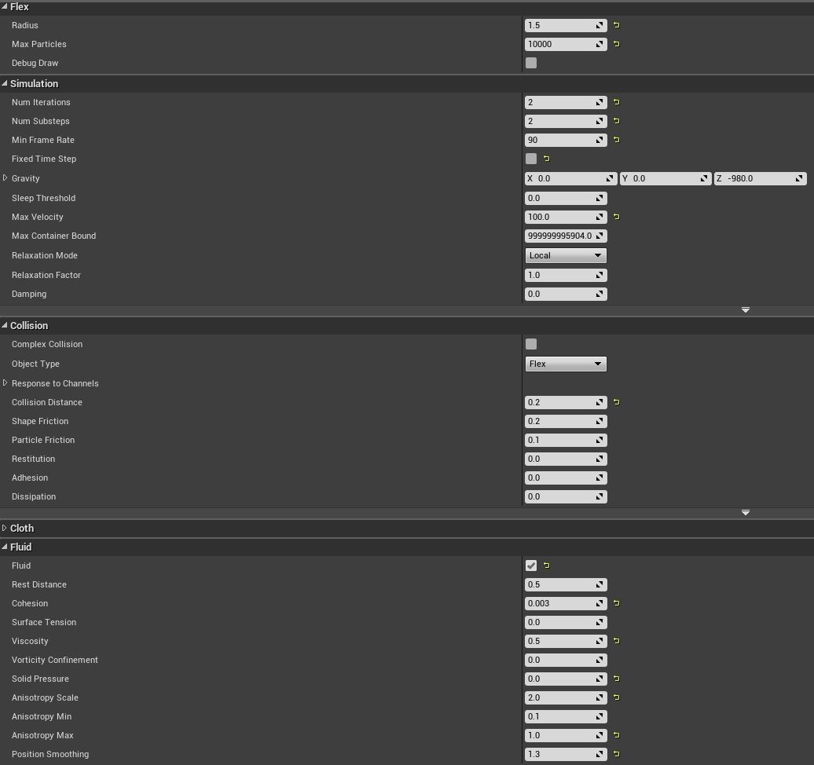
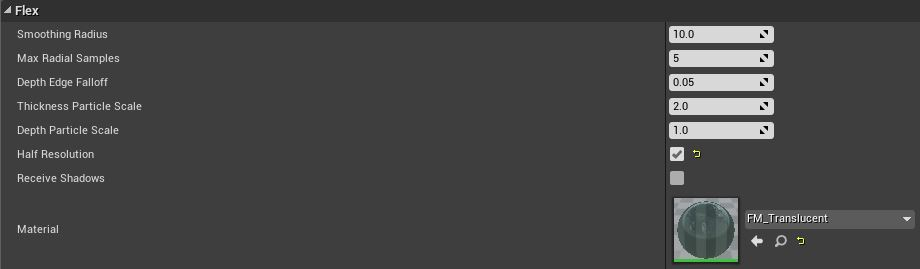

## Tutorial

This tutorial will show and explain the settings made to realistically visualize water coming out of the tap with the Flex Particle System. As far as possible, a good compromise between performance savings and visualization was the goal. As a result, the individual settings of the emitter, the Flex container and the Flex Fluid Surface are discussed.

### Emitter

Flex is integrated into the Cascade Particle System so any normal UE4 Particle Emitter can be used to emit Flex Particles. All you have to do is add the Spawn Flex Fluid/Shape module to the emitter. For the simulation of the used water the following settings were selected for the Spawn Flex Fluid module: 

Under this [link](http://docs.nvidia.com/gameworks/content/artisttools/Flex/FLEXUe4_Particles.html#particle-emitter) you can find more detailed definitions of the settings. In addition, the modules Initial Size and Kill Height have been added to the emitter. The settings of these modules are:

Each particle emitter contains a Required Module that contains all the properties a particle emitter needs. This module includes the following:

In addition, the emitter is defined by the Particle Module. The Particle Module is the base class for all modules. This means that all modules contain these properties. The properties chosen for this emitter are as follows:

### Container

The simulation properties of the flex system are determined by the container. Containers can be considered as a kind of scene. However, at certain times several containers can be active in one level. Actors such as particle systems, static nets or ropes emit particles and restrictions into the container and are stimulated when ticked. The parameters that need to be adjusted in the Flex Container to produce a good water quality are:

For detailed information on the individual settings, please refer to the following links:
* [link](http://docs.nvidia.com/gameworks/content/artisttools/Flex/FLEXUe4_Containers.html)
* [link](http://docs.nvidia.com/gameworks/content/artisttools/Flex/FLEXUe4_FluidSurfaceRendering.html#container)

### Surface 

The surface rendering is configured using Flex Fluid Surface templates. The fluid surface template can then be assigned to the corresponding emitters to render the associated particles with the surface technique. The following settings were selected in the project for the Flex Fluid Surface templates:

A more detailed explanation of the settings can be found under this [link](http://docs.nvidia.com/gameworks/content/artisttools/Flex/FLEXUe4_FluidSurfaceRendering.html#creating-a-flex-fluid-surface).

