# Tutorial

1. After starting any simple map that has at least two static meshes to be
   connected to each other, you can simply find the Static Srew Joint by
   searching for it (after having moved the directory into the plugin folder of
   your project).

* 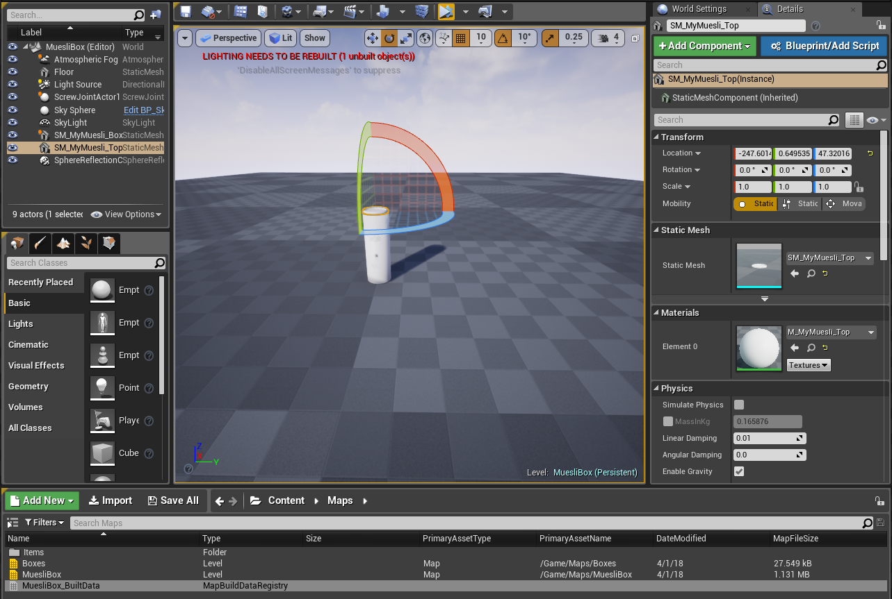
* 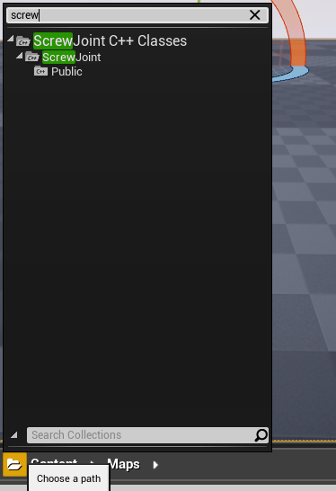
* 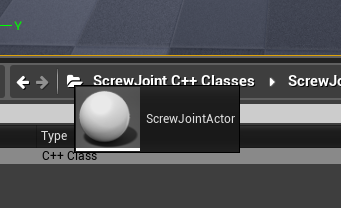

2. In the begining it does not matter where you move your screw joint, it will
   position itself automatically. Simply drag it into the scene and then go to
   the "ScrewJoint->Components" setting, select the picking tool or type in your
   components name for lid and container.

* 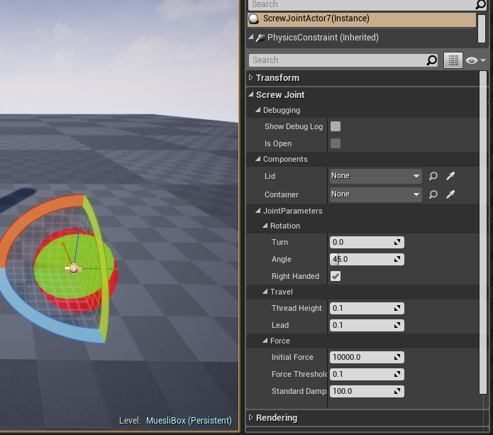
* 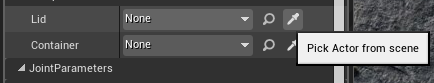

3. After having chosen both components, the constraint will position itself at
   the right position and you can change any other settings you want to have
   (e.g. debugging output, handedness or the angle)

* 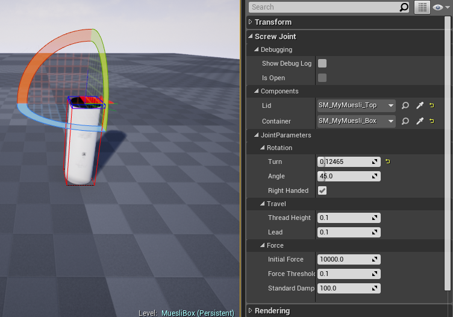
* 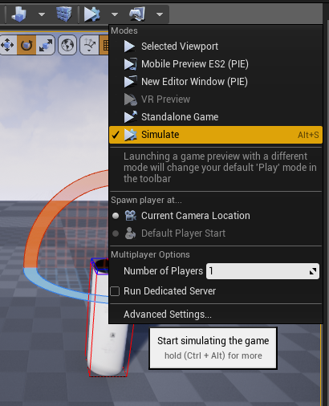

4. Having the debug output activated, you'll get a clean small area in the left
   top corner. Most interesting: The "Open"-Flag. Once you turn your lid
   component in the right direction for the needed amount, this will change into
   "yes", and you can freely move the lid around.

* 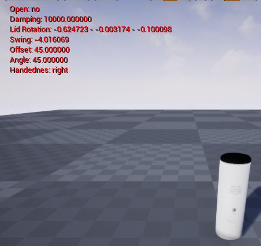
* 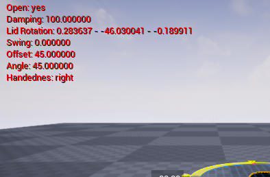
* 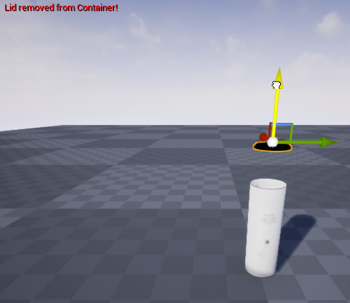

5. If you want to reattach the lid, just put it back at the correct positon and
   give it a gentle twist.

* 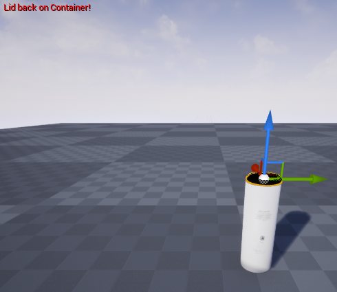
* 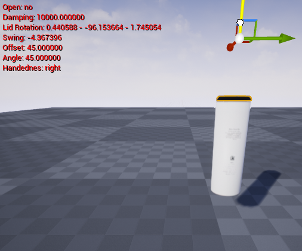

