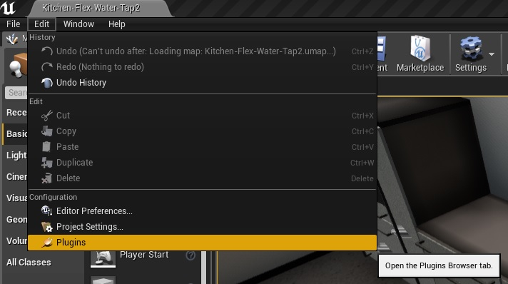
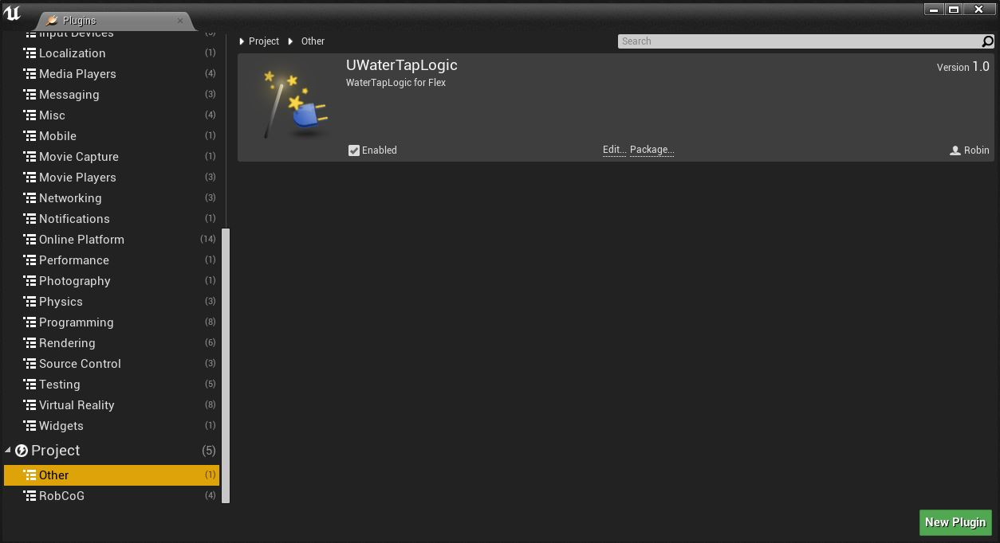
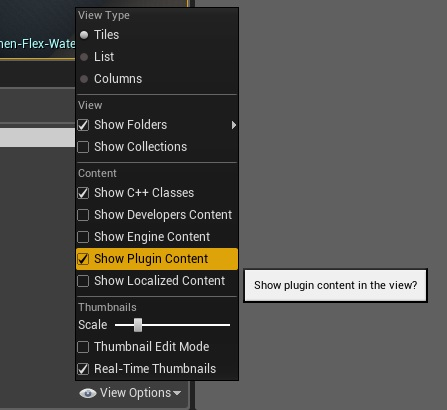
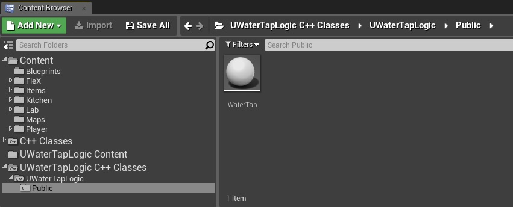
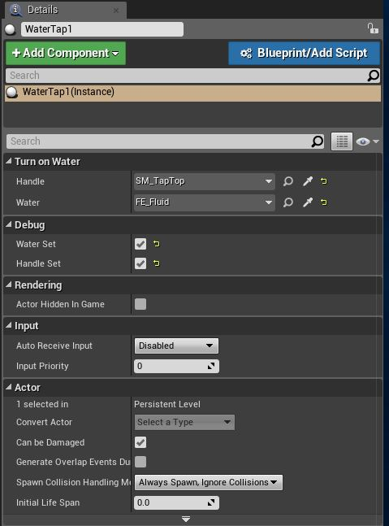

# How to use the UWaterTapLogic Pulgin

This tutorial shows step-by-step how to activate and use the UWaterTapLogic Pugin.

**Step 1:** 
Open the plugin window under Edit -> Plugins.

**Step 2:**
Go to “other” and switch the toggle  “enable” on at the UWaterTapLogic. Then the Unreal Engine must be restarted.

**Step 3:**
Now you have to switch the toggle “Show Plugin Content” on in the Content Browser under View Options.

**Step 4:**
The plugin is now visible in the content browser. You find this under the sources panel  UWaterTapLogic C++ Classes ->UWaterTapLogic ->Public.

**Step 5:** 
Now you must drag the WaterTap Actor into world. Then you have to go to the menu item “Turn on Water” in the Details. 
Now you can use the eyedropper symbol to select the water tap handle and the Flex emitter from the world.
In the field “Handle” you have to add the water tap handle and the flex emitter in the field “Water”. Now the emitter can be activated and deactivated by means of a handle.

