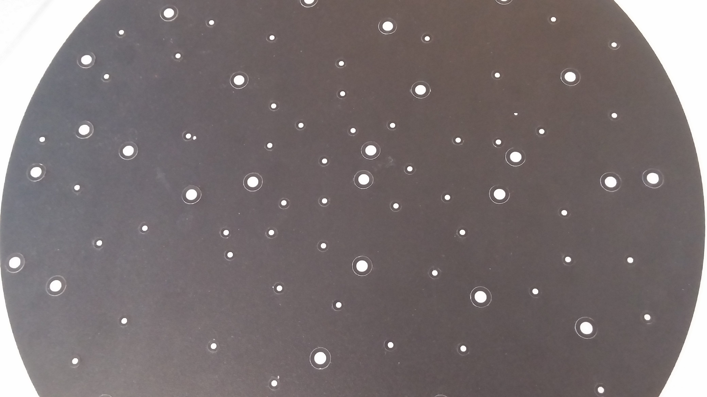
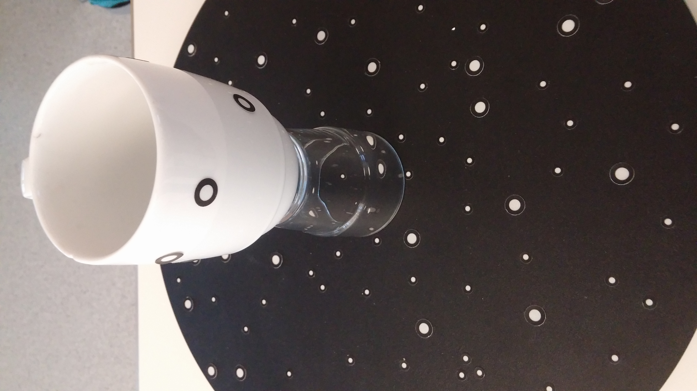

# Instructions for scanning objects with Vxelements 

This guide is intended to facilitate the software and scans of objects. These instructions are based solely on my experience and that an optimal solution is displayed. Before you can start scanning, you must do the following: 

 * In order for the scanner / vxelements to know where the object to be scanned is in the room and what spatial orientation it has to the scanner, at least the area on which the object rests must be equipped with a large area marker .  It is recommended that the surface has a very dark color or is black, and provides a very good contrast to the marker. This is so important when placing the markers that they are so big that they do not get too big. Whenever the scanner / vxelements lose their orientation. Another advantage is provided by a rotating background. This is the scan of this scanned scanner for a scanner.

 * Since a finished scan always contains perturbation objects that appear in the form of the background surface or other unwanted spatial objects, attention must be paid to the positioning of the object. If the object to be scanned lies directly on the background surface, it must be painstakingly removed in the subsequent reworking. In order to facilitate the rework, the object should only have direct contact with transparent surface, since transparent surface (such as glasses) are not perceived by the scanner and thus allow the object to float. 

 * In addition, the objects should also be marked with Maker. Again, care must be taken to ensure that no patterns occur multiple times. Especially important is the loading of markers for large objects and objects that have no special fixed points.

After the preparations have been done scanning can be started. To do this, the scanner is connected to a PC and the software Vxelements is started. After starting the program, you can press the Start button directly without making any further settings (see picture).
To ensure the scanner is properly calibrated, it should be calibrated before scanning. To do this, press the Scanner calibration button (see picture). After pressing the button, a new window is created in which several dimension displays for calibration are displayed (see picture). Calibration is performed with the calibration board attached to the scanner (see picture). To calibrate, all displays must be kept in their respective green areas.
After the calibration, scanning can be started by simply pressing the Scan button. When scanning, make sure that the scanner is at the correct distance to the object. Vxelements offers a dimension display (see picture). These dimensional displays should also be in the green range throughout. To check the scanned model, press the Preview button (see picture).
If the scanned model meets the requirements, all the interfering objects can be removed using the Edit scan tool (see picture). To remove the background, use the function automatic background selection with setting 50 and then press the Delete button. All remaining interfering objects are removed with the Remove isolated patches function. Usually a setting level of 18 is sufficient.

After all the disturbing objects have been removed, the scanning can be stopped by pressing the Scan button. Because the markers create holes in the model, the function Auto. fill holes used (see picture). This feature closes the holes in model by itself. The adjustment can be made according to this. Since the object can only be scanned from one side at a time, the same procedure must be repeated with the one on the side of the object on which the object previously lay. In order not to delete the previously created model or create a new scan with the button Add scan (see picture). Once there is a top and bottom model, they must be merged using the Merge scan feature (see picture). In merge mode, both objects must be selected beforehand (see picture). Then you have to select Surface Best-Fir in the mergesettings (see picture). Pressing the Pre-align button opens two new windows (see picture). Each window shows one side of the model. With the left mouse button markings can now be placed on the models. The markers should always be executed in parallel on each model. In addition, the markings must be placed at the same positions on both models. The markers serve the program to create a single model from the two models. Once enough markers have been placed, the Align button can be used to join both models together. In order to confirm the selection, the Accept button must be pressed (see picture). The best results were achieved with a maximum distance of 1mm. To perform the merge only the Merge button must be activated (see picture). Again, the best results were achieved with a setting of 1mm. Now the finished model can be exported as an object file. To do this, just press the Export tab under the File tab and select the setting as the object file. 

