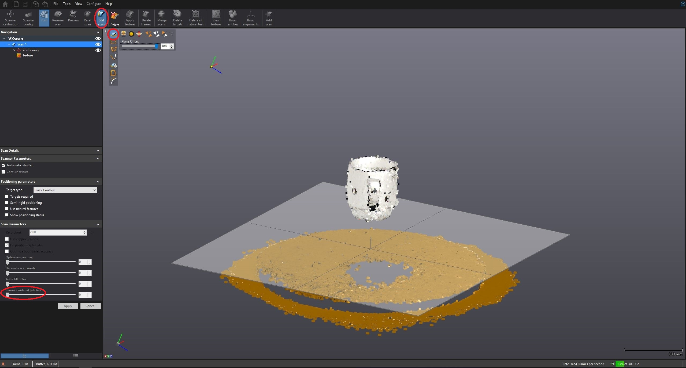

# Instructions for scanning objects with Vxelements 

This manual is intended to facilitate the entry into the software Vxelements and the scanning of objects. This guide is based solely on my experience and should not be considered an optimal solution. Before you can start scanning, preparations must be made.  

 * In order for the scanner / vxelements to know where the object to be scanned is located in the room and which spatial orientation it has to the scanner, at least the area on which the object rests must be equipped with a large area marker.  It is recommended that the surface has a very dark color or is black, as this provides a very good contrast to the marker. It is important to note when placing the markers that they are placed very arbitrarily, so that no patterns arise that occur several times. If several identical patterns occur, the scanner / Vxelements would lose its orientation. Another advantage is offered by a rotatable surface. This greatly facilitates the scanning of an object, since the scanner can assume a fixed position and thus always offers an optimal distance and angle. 

 * Since a finished scan always contains jamming objects that appear in the form of background surfaces or other unwanted spatial objects, care must be taken  when positioning the object. If the object to be scanned lies directly on the background surface, the background  must be laboriously removed in the subsequent reworking. To facilitate the rework, the object should only have direct contact with the transparent surface, since transparent surface (such as glasses) are not being recognised by  the scanner and  the object is being percieved as levitating.  

 * In addition, the objects should also be marked with a marker. Again, care must be taken to ensure that no patterns occur multiple times. The important thing is the loading of marks for large objects and objects that do not have special fixed points.  

After the preparations have been made, scanning can be started. To do this, the scanner is connected to a PC and the software Vxelements is started. After starting the program, you can press the Start button directly without making any further settings. 
To ensure that the scanner is properly calibrated, it should be calibrated before scanning. To do this, press the Scanner calibration button.  After pressing the button, a new window is created in which several dimension displays for calibration are displayed. Calibration is performed with the calibration board attached to the scanner.  To calibrate, all displays must be kept in their respective green areas.
After the calibration, scanning can be started by simply pressing the Scan button. When scanning, make sure that the scanner is at the correct distance to the object. Vxelements offers a dimension display.  These dimensional displays should also be in the green range throughout. To check the scanned model, press the Preview button. 
If the scanned model meets the requirements, all the interfering objects can be removed using the Edit scan tool.  To remove the background, use the function automatic background selection with setting 50 and then press the Delete button. All remaining interfering objects are removed with the Remove isolated patches function. Usually a setting level of 18 is sufficient.

After all the disturbing objects have been removed, the scanning can be stopped by pressing the Scan button. The markers create holes in the model, in order to  correct the holes which are  the function Auto fill holes can be used.  This feature automatically closes the holes in the model. The adjustment can be made according to this. Since the object can only be scanned from one side at a time , the same procedure must be repeated with the one on the side of the object on which the object previously lay. In order to not delete the previously created model or create a new scan use the button Add scan.  Once there is a top and bottom model, they must be merged using the Merge scan feature.  In merge mode, both objects must be selected beforehand.  Then you have to select Surface Best-Fit in the mergesettings. Pressing the Pre-align button opens two new windows.  Each window shows one side of the model. With the left mouse button markings can now be placed on the models. The markers should always be executed in parallel on each model. In addition, the markings must be placed at the same positions on both models. The program uses the markers to create a single model from the two models. Once enough markers have been placed, the Align button can be used to join both models together. In order to confirm the selection, the Accept button must be pressed.  The best results were achieved with a maximum distance of 1mm. To perform the merge only the Merge button must be activated. Again, the best results were achieved with a setting of 1mm. Now the finished model can be exported as an object file. To do this, just press the Export tab under the File tab and select the setting as the object file. 

