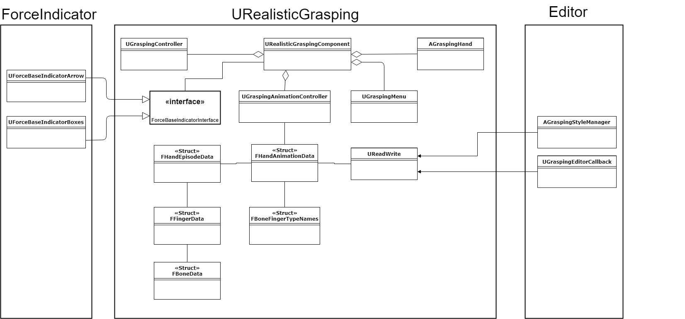
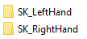

# Class description

Our plugin is divided into three different modules. **URealisticGrasping** (the actual logic part), **URealisticGraspingEditor** (the editor part) and **URealisticGraspingForceIndicator** (the force indicator example part)
In this image you can see how our classes are separated and how they are working together. (Basically there are four modules but the module **URealisticGraspingUI** isn't separated correctly from the logic part. 
That's why we didn't count it as a real module. You can delete both other modules without any side effects but it will cause an error if you delete this module.)



* Our **URealisticGraspingComponent** needs two hands of type **AGraspingHand** to work properly. You still need to add the mesh, that you want to use to this hand class. In addition, the hands must still be added to the character.
(see documentation [how to use our plugin](tutorialChar_Bind.md))

* The UGraspingController is responsible for the grasping.

* The UGraspingAnimationController holds all available animations for both hands. If you want to change an animation you need to do it in this class. When the animation changes, you can get a notification, if you bind a function
to our delegate. In order to bind a function to our delegate you will need a function like this:

```cpp
UFUNCTION()
void Test(FHandAnimationData Data);
```

We have two delegates. One for the left and one for the right hand.

```cpp
FNextAnimationDelegateR OnNextAnimationR;
FNextAnimationDelegateL OnNextAnimationL;
```

Then you can bind your function.

```cpp
OnNextAnimationR.AddDynamic(this, &YOURCLASS::Test);
OnNextAnimationL.AddDynamic(this, &YOURCLASS::Test);
```

* **UReadWrite** is a utility class to read and write from or to unreal engine 4 configfiles. The save or reading location is located in the **GraspAnimations** folder in the project folder. Our class will create for every mesh one subfolder and these
subfolders will get the same name as the associated mesh. So all animations for one same mesh are packed in one folder. Be aware the write function will override an existing file. An example could look like this:



* A **UGraspingAnimationController** can have any number of animations from the type **FHandAnimationData**. This struct contains the most important information about an animation. For example, the animation name (later file name),
the mesh name (later directory name), information about the all used bones and the different episodes of this animation.

* One step of an animation has the type **FHandEpisodeData**. This class summarizes the 5 different **FFingerData** data in one step (because a human has 5 fingers/one thumb).

* **FFingerData** has zero or more **FBoneData**. One **FFingerData** contains for every bone that belongs to this finger every data (Orientation data) for one episode.

* **FBoneData** contains every information (like their component space orientation or bone space orientation) that are needed to use a grasp.

* **FBoneFingerTypeNames** keeps some important information, such as witch bones are important to the animations and to which finger this bone belongs to.

* **UGraspingMenu** is used to visualize the process on how you can change a grasp. See their own documentation.

* The interface **ForceBaseIndicatorInterface** is used as an interface between our grasping component and the force visualization. With this method you can easily change the visualization part without changing
the logic part. See for more informations the tutorial on [how to use the force base indicator interface](DokuForceIndicator.md)

* The two classes in the ForceIndicator module **UForceBaseIndicatorArrow** and **UForceBaseIndicatorBoxes** are two examples on how you can use the force visualization part. [See the documentation](DokuForceIndicator.md)

* The two classes in the Editor module are also separated from the logic part because of that you can easily change them and use your own version to create an animation. The class **AGraspingStyleManager** is used to
create an animation out of an unreal engine 4 animation ([See the documentation](CreateNewAnimations.md)). The other class is used to create an animation out of the editor ([See the documentation](CreateNewAnimationsWithEditor.md))

# Configuration file

* A configuration file represents one animation
* You can read a configuration file into one **FHandAnimationData** (use the read function in **UReadWrite**)
* You can write one **FHandAnimationData** into a configuration file (use write function in **UReadWrite**)
* The configuration files are located in the config directory in our plugin

* An example file with 5 bones might look like this:

```
[GeneralInformations]
Name=Lateral
SkeletalName=SK_RightHand
NumberOfEpisodes=2
NumberOfBones=5

[BoneNames]
BoneName0=middle_01_r
BoneName1=index_01_r
BoneName2=ring_01_r
BoneName3=pinky_01_r
BoneName4=thumb_01_r

[BoneToFingerTypeInformations]
middle_01_r=2
index_01_r=1
ring_01_r=3
pinky_01_r=4
thumb_01_r=0

[BoneTypeInformations]
middle_01_r=2
index_01_r=2
ring_01_r=2
pinky_01_r=2
thumb_01_r=2

[BoneSpaceAfterCalcStep0]
index_01_r=P=0.000000 Y=0.000000 R=0.000000
middle_01_r=P=0.000000 Y=0.000000 R=0.000000
pinky_01_r=P=0.000000 Y=0.000000 R=0.000000
ring_01_r=P=0.000000 Y=0.000000 R=0.000000
thumb_01_r=P=0.000000 Y=0.000000 R=0.000000

[BoneSpaceBeforeCalcStep0]
index_01_r=P=59.099686 Y=-128.018997 R=140.452255
middle_01_r=P=87.000031 Y=178.678757 R=89.220695
pinky_01_r=P=62.656834 Y=12.342489 R=-81.307007
ring_01_r=P=85.399796 Y=-2.922055 R=-95.448288
thumb_01_r=P=-8.633474 Y=-139.562943 R=126.228691

[ComponentSpaceStep0]
index_01_r=P=-14.491960 Y=25.239746 R=84.323196
middle_01_r=P=0.576584 Y=-0.033539 R=88.870346
pinky_01_r=P=30.012491 Y=-7.432471 R=82.484802
ring_01_r=P=8.175510 Y=0.049335 R=85.811768
thumb_01_r=P=-47.850365 Y=98.869370 R=32.000820

[BoneSpaceAfterCalcStep1]
index_01_r=P=0.106168 Y=0.089446 R=0.523247
middle_01_r=P=0.061014 Y=-0.037125 R=0.538820
pinky_01_r=P=0.037764 Y=0.084716 R=0.525181
ring_01_r=P=0.026207 Y=0.049848 R=0.540618
thumb_01_r=P=0.189831 Y=-0.217917 R=-0.024145

[BoneSpaceBeforeCalcStep1]
index_01_r=P=58.960854 Y=-128.021637 R=140.973160
middle_01_r=P=87.037392 Y=179.849503 R=90.928818
pinky_01_r=P=62.746281 Y=12.288923 R=-80.829468
ring_01_r=P=85.446877 Y=-3.310387 R=-95.294785
thumb_01_r=P=-8.569777 Y=-139.277817 R=126.162277

[ComponentSpaceStep1]
index_01_r=P=-14.570432 Y=25.358047 R=84.816673
middle_01_r=P=0.614908 Y=0.026742 R=89.409821
pinky_01_r=P=29.933432 Y=-7.376478 R=83.037941
ring_01_r=P=8.127707 Y=0.079420 R=86.356659
thumb_01_r=P=-47.573841 Y=98.744553 R=32.069378
```

* **GeneralInforamtions** and **BoneNames** are mainly needed to read the data correctly and are pretty much self-explanatory.

* **BoneToFingerTypeInformations** shows which bone belongs to which finger. Underlying the [human skeleton of a hand] (https://en.wikipedia.org/wiki/Hand). Where 0 = thumb, 1 = index, 2 = middle,
3 = ring, 4 = pinky.

* **BoneTypeInformations** specifies the bone type. See also the [Human Skeleton of a Hand] (https://en.wikipedia.org/wiki/Hand). Where 0 = metacarpal, 1 = proximal phalanges, 2 = intermediate phalanges, 3 = distal phalanges

* **BoneSpaceAfterCalcStepX** The actual episode where each bone is assigned the current orientation. These values are needed to grasp in game.

* **BoneSpaceBeforeCalcStepX** this values are needed in order to use them in the editor (e.g to change one step in the editor [See documentation]()NOT WORKING)

* **ComponentSpaceStepX** this values are needed in order to enable the tightening grasp