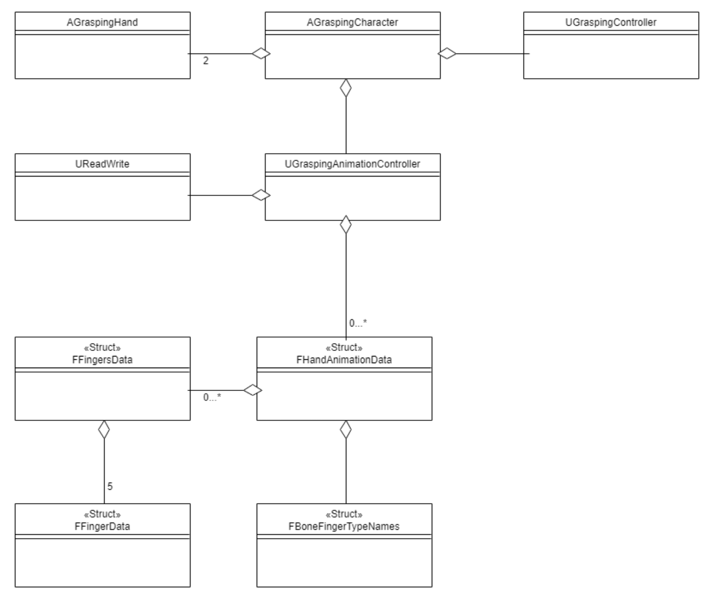

# Class description

Currently our plugin works only if you take the character from our plugin (AGraspingCharacter). In the future, you just need to add an actor component to your character.
Therefore, our character currently looks like this:



* Our character needs two hands of type AGraspingHand to work properly. You still need to add the mesh, that you want to use to this hand class. In addition, the hands must still be added to the character.

* The UGraspingController is responsible for the grasping.

* The UGraspingAnimationController holds all available animations for both hands. If you want to change an animation you need to do it in this class. When the animation changes, you can get a notification, if you bind a function 
to our delegate. In order to bind a function to our delegate you will need a function like this:

```cpp
UFUNCTION()
void Test(FHandAnimationData Data, bool bIsRightHand);
```
Then you can bind your function.
```cpp
OnNextAnimation.AddDynamic(this, &YOURCLASS::Test);
```

* UReadWrite is a utility class to read and write from or to unreal engine 4 configfiles. The save or reading location is located in the config folder in our plugin. Our class will create for every mesh one subfolder and these 
subfolders will get the same name as the associated mesh. So all animations for one same mesh are packed in one folder. Be aware the write function will override an existing file. An example could look like this:


* A UGraspingAnimationController can have any number of animations from the type FHandAnimationData. This struct contains the most important information about an animation. For example, the animation name (later file name), 
the mesh name (later directory name), information about the all used bones and the different steps of this animation.

* One step of an animation has the type FFingersData. This class summarizes the 5 different FFingerData data in one step (because a human has 5 fingers/one thumb).

* FFingerData keeps the orientation to each bone of the finger for one step.

* FBoneFingerTypeNames keeps some important information, such as witch bones are important to the animations and to witch finger this bone belongs to.

# Configuration file

* A configuration file represents one animation
* You can read a configuration file into one FHandAnimationData (use the read function in UReadWrite)
* You can write one FHandAnimationData into a configuration file (use write function in UReadWrite)
* The configuration files are located in the config directory in our plugin

* An example file with 5 bones might look like this:

```
[GeneralInformations]
Name=Tripod5
SkeletalName=SK_RightHand
NumberOfEpisodes=2
NumberOfBones=5

[BoneNames]
BoneName0=middle_01_r
BoneName1=index_01_r
BoneName2=ring_01_r
BoneName3=pinky_01_r
BoneName4=thumb_01_r

[BoneToFingerTypeInformations]
middle_01_r=2
index_01_r=1
ring_01_r=3
pinky_01_r=4
thumb_01_r=0

[BoneTypeInformations]
middle_01_r=2
index_01_r=2
ring_01_r=2
pinky_01_r=2
thumb_01_r=2

[Episode0]
index_01_r=P=0.000000 Y=0.000000 R=0.000000
middle_01_r=P=0.000000 Y=0.000000 R=0.000000
pinky_01_r=P=0.000000 Y=0.000000 R=0.000000
ring_01_r=P=0.000000 Y=0.000000 R=0.000000
thumb_01_r=P=0.000000 Y=0.000000 R=0.000000

[Episode1]
index_01_r=P=15.510942 Y=-24.652712 R=-0.993602
middle_01_r=P=-0.577144 Y=0.022166 R=1.129371
pinky_01_r=P=-30.573557 Y=4.221374 R=4.365925
ring_01_r=P=-8.149883 Y=-0.650849 R=4.238115
thumb_01_r=P=51.016167 Y=-99.466301 R=-55.577969
```

* GeneralInforamtions and BoneNames are mainly needed to read the data correctly and are pretty much self-explanatory.

* BoneToFingerTypeInformations shows which bone belongs to which finger. Underlying the [human skeleton of a hand] (https://en.wikipedia.org/wiki/Hand). Where 0 = thumb, 1 = index, 2 = middle,
3 = ring, 4 = pinky.

* BoneTypeInformations specifies the bone type. See also the [Human Skeleton of a Hand] (https://en.wikipedia.org/wiki/Hand). Where 0 = metacarpal, 1 = proximal phalanges, 2 = intermediate phalanges, 3 = distal phalanges

* EpisodeX The actual steps where each bone is assigned the current orientation.