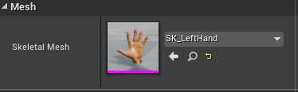
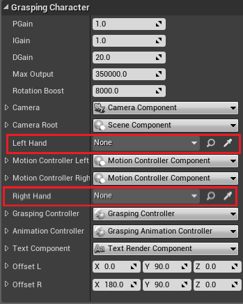
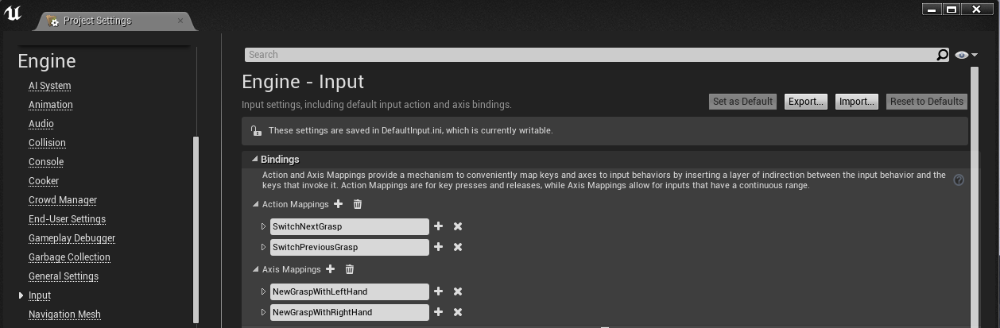

# How to use our character

* Go to the model editor and search for the Grasping Character and the Grasping Hand.

* Place one Grasping Character and two Grasping hands in your world

* Select the both hands and select a mesh that you want to use. (The Mesh that you used for creating an animation and this mesh should be the same 
(The mesh name is important to find all animations))

* Add both hands to the character

* Thats it!

# Key Bindings

In order to grasp or to switch the grasping style you need to bind some keys for it.

* With SwitchNextGrasp and SwitchPreviousGrasp can you change your grasping style.

* With NewGraspWithLeftHand and NewGraspWithRightHand can you grasp something.