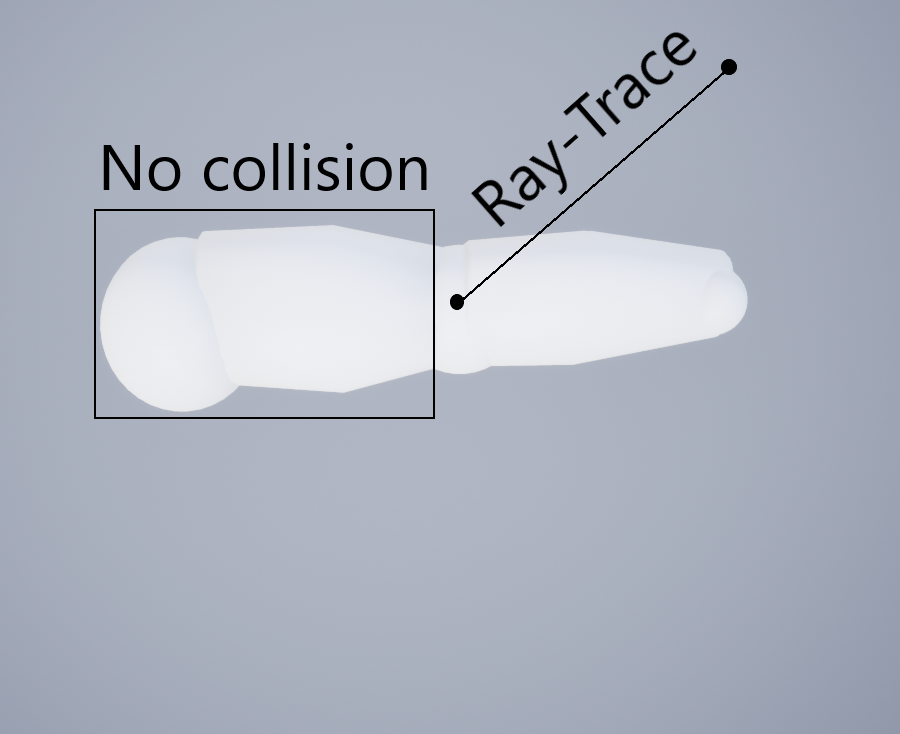

# Collision description
The collision detection for our arms are currently working very limited. As you can see in the following picture, basically only the forearm has collision enabeld. A ray-trace line is drawn from the elbow to the new position, which the hand sould reach. This works because the tick rate comes in fairly short time intervals.


# Detect a collision
If there is a collision, you can get a notification if you want to. The class ArmAnimInctance has a delegate for this purpose. So, if is desired to know when a collision occurs,
you can easily bind a function, which is called whenever a collision occurs. Below is an example of how a function can be bound.

Your function needs a parameter like this:
```cpp
	UFUNCTION()
	void Test(FHitResult HitObject);
```

After this you can bind your function like this:

```cpp
OnCollisionDelegate.AddDynamic(this, &UArmAnimInstance::Test);
```

# Problems
* First we tried to solve a collision with Physics Animations. However, this has led to a problem. Everytime when no collision occurs,
the actual animation that we get through the movements of the controllers was overwritten. It still works, but the movements doesen't match with those of the
real world. In many cases we discovers that the arms movement are too slow when compared with the reeal world, so this did not seem appropriate. 
Also, changing the strenght of the physics animation did not seem to work, because when we set the strenght under 1 we discovers that the arm can go in objects and the 
strenght wasen't hight enought to push it back.
* At the moment, the collision works only for the forearm in a very simpel way. For a better collision detection multiple ray traces are needed
but this in turn leads to their own problems, for example, how to deal with multiple hits.
* Collisions with themselves do not currently work with Ray-Traces. Physics animation, on the other hand, would just allow this.

# TODOS
* Physics Animations are already working quite well, if only there wasen't the problem with overwriting in case of non existing collisions.
Therefore, it would be nice to see how animations can possibly be combined (see useful links). Alternatively, to recognize when and where a collision occurs and then turn 
the physics animation on or off dynamically.
* Use more Ray-Traces and combine them. Should be the last choice, because this is quite complicated and maybe not the best way to do it.

# Usefull links
* https://docs.unrealengine.com/en-us/Engine/Animation/PhysicallyDrivenAnimation
* https://docs.unrealengine.com/en-us/Engine/Animation/AnimHowTo/AdditiveAnimations