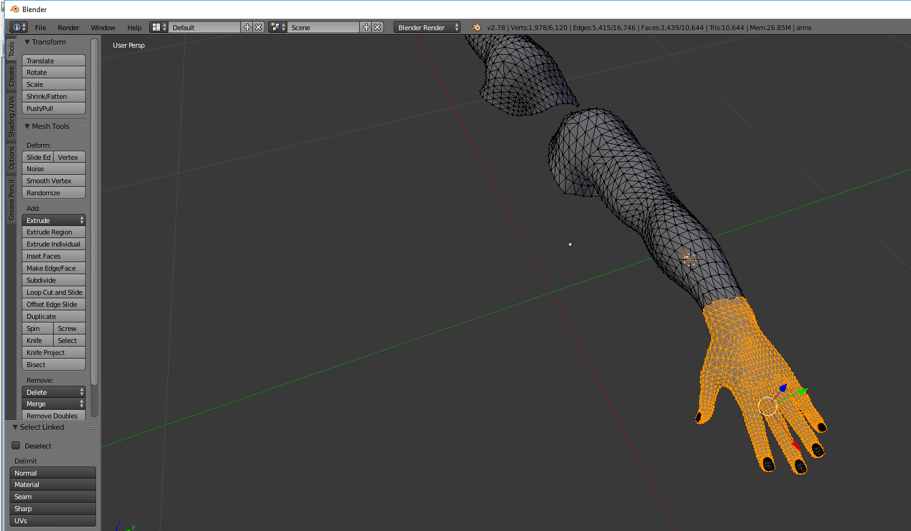
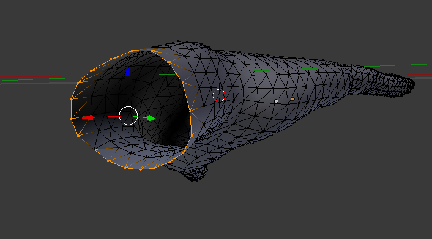
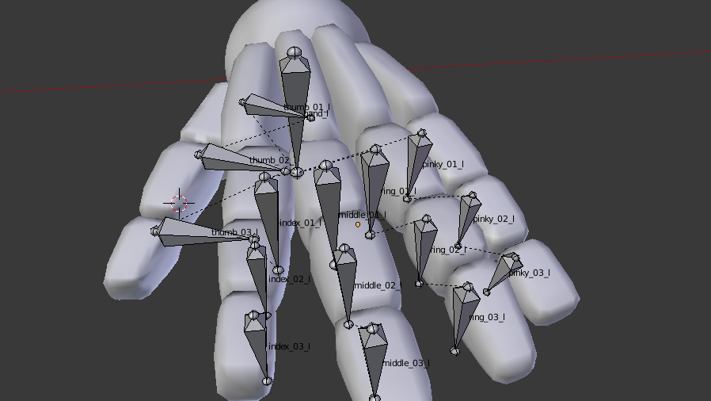

Tutorial on how to rig a hand, import in Unreal engine and use it as actor for the mesh. Check this video which shows Step 1 - 7 https://youtu.be/IBg6zL6Maxg.

If you have to cut the hand from the rest of the mesh then go to tutorialMesh.md and have look how to cut the rest from the body and use the hands from now on.

Step 1: Import your mesh into blender

Step 2: Select your mesh in Object mode and go into Edit mode

Step 3: Deselect the mesh

Step 4: Point with your cursor over the hand and press L. The hand should be selected like this:

Step 5: If there are missing parts hover over these parts and press L.

Step 6: Press P and select Selection. Now you have two seperate meshes.

Step 7: Delete the mesh you do not need anymore.

Step 8: To fill out the hand select all the verticies in edit mode like in the picture below and press F 

Step 8: Change the hand transform to the origin of the coordinate system

You can also select the pieces of the mesh you want to delete manually using shift + right click or B for box selection.

If you want to have bones for the hand you can have it like this:

Look at the tutorialMesh.md if you want to add bones.

Make sure that the hand tranform is changed to the origin of the coordinate system in blender.

Now the steps you need to follow in order to add your hand to the Character in our project

Step 1:Import your fbx file with the hand in Unreal Engine by droping it in the content browser.

Step 2:Add a socket bone to the hand_l / hand_r bone and name it hand_rSocket / hand_lSocket.

Step 3:Add a new actor and add a skeletal mesh component to it.