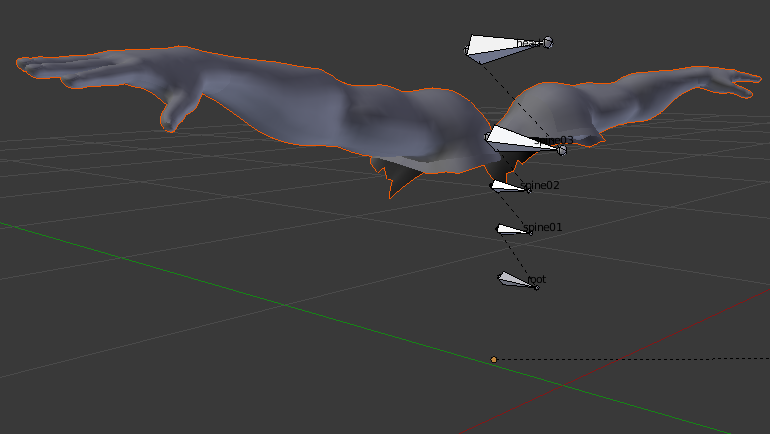
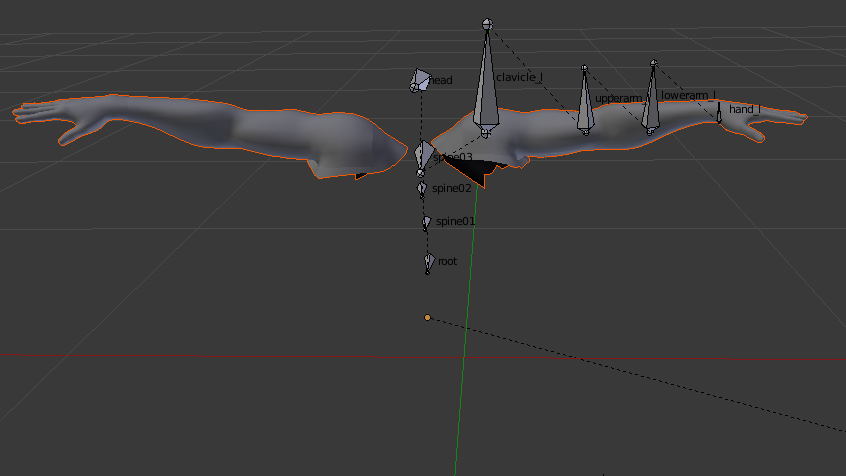
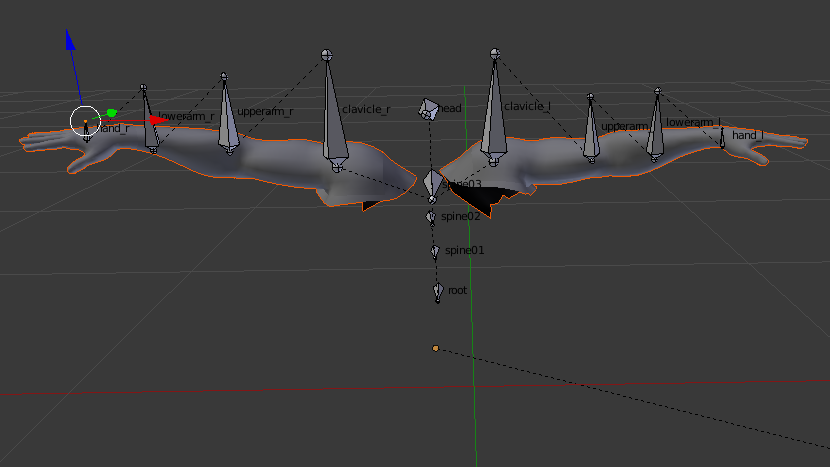

Tutorial on how to rig a mesh and import it in the unreal enginge using blender.

Follow these steps to rig your mesh. You should follow the first few steps if your mesh has hands and you want to cut them from the mesh. If not then continue with step 8.D

Step 1: Import your mesh in blender.
Step 2: Select your mesh in Object mode and go into Edit mode
Step 3: Deselect the mesh
Step 4: Point with your cursor over the hand and press L. The hand should be selected like this:

Step 5: If there are missing parts hover over these parts and press Look
Step 6: Press P and select Selection. Now you have two seperate meshes.
Step 7: Delete the mesh you do not need anymore.

You can also select the pieces of the mesh you want to delete manually using shift + right click or B for box selection.

Step 8: Go to object mode and press shift A. There you select Armature -> Single Bone to create your root bone. You can select your newly created armature, go to the Armature tab and under Display check Names and X-Ray. Now you can see your bones through the mesh. Keep the naming you see in the following pictures. These are important.
Have a look at the folder video in the documentation folder to see a short video on how to create an armature bone with a child bone. The video is called CreateArmature.
Step 9: Now change to the Edit mode, select the tip on the bone and press E. With this you can create new bones. Create new bones until your skeleton looks like this image. To disconnect a bone select the bone, go to the Bone tab of your newly created and check Connected in the Relations tab. Then you can rearange their position.

Step 10: Select the spine03 bone and press E on its tip to create a new bone. Create the following hand bones. You have to create the hand bone even if you cutted the hand of the mesh in the beginning. Have to positions of the bones like this:

Step 11: Now you select all bones from the clavicle to the hand bone (multiple selection with shift). Then press shift + D, then S, then x or y or z depending on which axis your selected bones were and then -1. Now you duplicated the selected bones with correct parenting. Move those duplicated bones to the correct position.
Step 12: Select the newly created duplicated bones, go to armature on the bottom left of blender and click flip names.
Step 13: Now you have to apply the bones to your mesh. Change to object mode, select the mesh, then the armature, press ctrl + P and select Set parent to object with automated weights. Change your mesh back to the original size if it has changed during this process.

Step 14: Now you can export your mesh as fbx. In the export dialog you can go to the Export FBX panel on the bottom left, go to Armatures and uncheck Add Leaf Bones. They are not needed but if they are present it will not change anything.
Step 16: Now drop your fbx in the Content browser of the Unreal enginge to import in there.

You can also check this video. I did most of the steps until minute 20 in this tutorial.
https://www.youtube.com/watch?v=mJwWTKt12ak&t=1290s